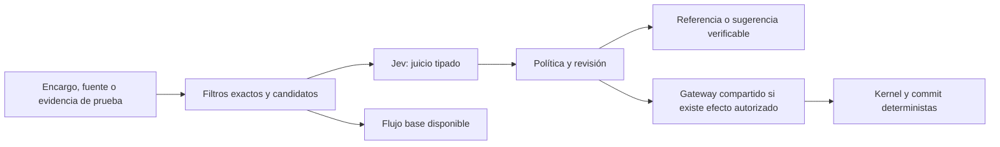

# Evaluación de Jev para opforja y su proceso de desarrollo

**Corte:** 2026-09-23. **Estado de las integraciones:** PROPUESTO. **Inferencia:** tres llamadas reales con `jev-1.13.0`, exclusivamente sobre casos sintéticos en español. **Base de código inspeccionada:** `07fddc1ec47950a53144e800d795d9e8405091eb`; especificación y plan del producto integrado presentes como cambios locales aún no confirmados.

Esta evaluación sirve al [plan de implementación](../roadmap/implementacion-producto-integrado.md). Conserva evidencia exploratoria y recomendaciones; no modifica la aceptación de I1–I6 ni acredita una integración desplegada. Las peticiones, etiquetas previas, distribuciones y metadatos están en el [registro reproducible](evidencia/2026-09-23-jev.json).

## 1. Decisión recomendada

Probar primero Jev como apoyo a la revisión de requisitos y evidencia del desarrollo. En el producto, comparar su utilidad para verificar apoyo documental y resolver consultas acotadas sobre operaciones existentes. Esas tres aplicaciones tienen una frontera explícita y pueden retirarse sin alterar el kernel.

La simplificación sería convertir interpretaciones repetidas en selecciones verificables, y conservar el resultado cuando siga vigente. Añadir un juicio a cada paso de un agente, cada pulsación o cada ejecución de CI puede aumentar costo, latencia y mantenimiento. No hay evidencia local de ahorro todavía.

Las oportunidades siguientes son hipótesis de valor ordenadas por proximidad a necesidades observables, facilidad de contraste y consecuencias del error. Las sondas solo exploran tres familias; las demás tienen respaldo arquitectónico o ejemplos externos, no medición propia.

## 2. Qué permite afirmar el repositorio

| Observación local | Consecuencia para esta evaluación |
|---|---|
| [quality-ledger](../../app/scripts/quality-ledger.mjs) localiza identificadores de leyes en tests y considera activa una ley cuando encuentra evidencia textual. | Sirve como inventario. Una revisión adicional puede contrastar condiciones y aserciones con requisitos; la presencia del identificador no prueba cobertura semántica. Esto no convierte el inventario en un bug. |
| [La ley de undo](../../app/src/leyes/undo.test.ts) prueba aplicar varios patches como una unidad, deshacer y rehacer por snapshots. | Ese archivo no ejercita la conservación de una edición humana intercalada exigida por T5/T9. Hace falta la prueba específica del nuevo requisito; un juicio no puede suplirla. |
| [La ley OPL](../../app/src/leyes/opl-reverse.test.ts) comprueba tanto el aviso como la conservación de enlaces, estados y entidades tras omitir una línea. | Sería incorrecto acusarla de cubrir solo el aviso. El revisor debe ver las aserciones y sus dependencias, no nombres o resúmenes incompletos. |
| [Acciones contextuales](../../app/src/store/acciones-contextuales.ts) ofrece un catálogo; [razonamiento](../../app/src/modelo/razonamiento/derivar.ts) ya deriva consultas cerradas. | Jev puede ayudar a elegir una operación y objetivo existentes. El resultado de la consulta sigue derivándose en código. |
| [Mesa de exploración](../../app/src/modelo/mesaExploracion.ts) conserva fuentes y propuestas; T7 propone ampliar herramientas y dependencias. | Hay un punto natural para contrastar afirmaciones con fragmentos autorizados, sin convertir la fuente ni al evaluador en autoridad. |
| [Equivalencia](../../app/src/modelo/equivalencia/verificar.ts) compara firmas de frontera y declara que no demuestra equivalencia total. | El parecido semántico puede recomendar piezas para examinar; nunca ampliar el alcance de esa garantía. |
| [Evaluación UX](../../app/scripts/evaluacion-ux-permanente.mjs) usa navegador y evidencia observable; el [índice de bugs](../bugs/INDEX.md) no contiene entradas activas en este corte. | Conviene conservar la observación directa. Un clasificador masivo de bugs o un sustituto textual de la revisión visual no atienden hoy una necesidad acreditada. |

Estas conclusiones proceden de lectura local. No se enviaron archivos del repositorio ni se ejecutaron estas pruebas de producto como parte de la sonda de Jev.

## 3. Oportunidades en el proceso de optimización

| Aplicación propuesta | Juicio y entrada mínima | Valor esperado, límite y prioridad |
|---|---|---|
| **Revisar requisito frente a evidencia** | Choice: cobertura directa, parcial, contraejemplo, sin evidencia. Requisito, precondiciones, aserciones, helpers pertinentes y resultado real si existe. | **Primera evaluación recomendada.** Puede descubrir cierres débiles en T3/T5/T6/T9. Señala dónde revisar; no aprueba un PR ni sustituye tests. La sonda evaluó descripciones sintéticas, no lectura de código. |
| **Preparar pruebas de aceptación reproducibles** | Choice entre paquetes completos de acción, objetivo y literal; elección de una aserción implementada. Escenario y catálogo real de controles/operaciones. | **Segunda línea del proceso.** Resolver durante autoría, revisar y congelar el artefacto; ejecutar después sin inferencia. Reducir esfuerzo de preparación de T8/T9/T12. No cambiar automáticamente selectores o expectativas en CI. |
| **Recuperar código y pruebas pertinentes** | Score con rúbrica autosuficiente de relevancia sobre fragmentos obtenidos por `rg` o un índice; ordenar en código. | **Piloto condicionado a búsquedas costosas.** Útil al cruzar módulos desconocidos. Comparar contra el mismo conjunto y formato de fragmentos sin Jev. No sustituir una búsqueda exacta de un símbolo ni excluir pruebas por ser pruebas. |
| **Contrastar el diff con el encargo** | Choice por requisito: atendido, parcial, contradicho, no evaluable; diff y contexto propietario mínimo. | **Complemento del primer piloto.** Puede detectar una edición ajena al alcance o una condición olvidada. El análisis estático, la revisión y las pruebas conservan su función; no pedir «¿es correcto este PR?» como juicio único. |
| **Clasificar fallos y escoger una comprobación** | Choice entre hipótesis/comprobaciones disponibles con error original, fase y cambios recientes. | **Condicionado a recurrencia.** Ayuda cuando varios síntomas se parecen. Códigos HTTP, estado del proceso y errores exactos se enrutan primero en código. No autoriza retries, instala dependencias ni convierte un fallo en éxito. |
| **Analizar evidencia de uso humano** | Clasificaciones separadas sobre observaciones textuales: navegación, comprensión, persistencia o recuperación; selección del fragmento que las apoya. | **Cuando haya sesiones reales de I1/I3.** Puede reducir codificación repetitiva y agrupar fricciones. Conservar discrepancias y palabras originales. No producir participantes sintéticos ni deducir legibilidad visual desde texto. |

La preparación de pruebas tiene un antecedente concreto: [Jevcumber, versión inspeccionada](https://github.com/RubyBrewsday/jevcumber/blob/4095527cf36b78a1796148d48d4cfa30c2398138/README.md) selecciona acciones y controles y permite reproducir un lockfile con `--frozen`, sin llamar a Jev; entradas ausentes o desactualizadas fallan. Es una implementación de referencia, no una dependencia recomendada para instalar ahora. Esa versión no cubre drag-and-drop y algunas expectativas permanecen como juicios live incompatibles con `--frozen`. Para el OPD de JointJS conviene preferir IDs semánticos, operaciones públicas y las pruebas existentes; un título visible no prueba que se preservó XOR.

El caso [PiJ, versión inspeccionada](https://github.com/tonyzdev/pijev/blob/dcce29fb3f9afcaa202ccd0d81a63f44df1d7ff0/README.md) ayuda a calibrar expectativas: sus autores reportan entre 16% y 25% menos llamadas a herramientas en los grupos comparados, pero resolución 15/20→14/20 y 4/13→4/13. El costo añadido de Jev superó el ahorro del modelo principal barato; el tiempo fue plano o peor. Son 33 tareas y una ejecución por configuración. Justifica probar recuperación dirigida, no afirmar mejora de resultados ni adoptar otro runtime de agentes.

## 4. Oportunidades dentro del producto

| Aplicación propuesta | Composición concreta | Encaje y criterio de valor |
|---|---|---|
| **Verificar fuente → afirmación** | Recuperar fragmentos originales; Choice por afirmación: respaldada, contradicha, evidencia insuficiente. Mostrar el fragmento y su versión. | **Primer candidato de producto, T7/T9.** Ejemplo: una fuente exime al retiro de repartidor y la propuesta lo exige. Medir falsas aceptaciones y cuántas correcciones útiles aparecen. Jev evalúa apoyo en una fuente, no su verdad ni autoridad. |
| **Interpretar consultas sobre el modelo** | Catálogo de paquetes válidos completos → Choice con `none`, `ambiguous`, `multiple` y encargo abierto → derivador determinista. | **Segundo candidato, T7/T8.** «¿Qué necesita Entregar?» frente a «¿qué cambia si lo quito?». Primero solo lectura. Debe ahorrar una llamada generativa o reducir errores frente a aliases; una invocación adicional sin beneficio no simplifica. |
| **Contrastar propuesta con restricciones verbales** | Delta formal y cláusulas del encargo → juicios separados de apoyo/contradicción/insuficiencia. | **Tras existir propuestas reales en I1.** Examinar «mantener retiro sin repartidor» o una restricción aún no formalizada. Si la condición ya está expresada como IDs, enlaces o XOR, usar código. No equivale a validar OPM. |
| **Elegir la aclaración útil** | Campos requeridos que faltan y preguntas de un catálogo → Choice sobre pregunta concreta, continuar o abstenerse. | **Después de observar interrupciones en T9.** Ejemplo: dos procesos con el mismo nombre y distinto contexto. Preguntar solo cuando afecta el resultado; ante permisos ausentes el servidor exige el acto correspondiente, no una predicción semántica. |
| **Revisar consecuencias de cambios en fuentes** | Dependencias e invalidación exactas en código; comparar fragmento anterior/nuevo con afirmaciones vinculadas para ordenar revisiones. | **T7 e I6.** Reducir revisión manual ante cambios editoriales o de alcance. Jev no mantiene válida una propuesta cuyo hash o base cambió: orienta la revisión posterior. |
| **Sugerir correspondencias al importar o actualizar piezas** | Parser obtiene registros y spans; catálogo de destinos compatibles → Choice de correspondencia o ninguna. Validación y copia exacta en código. | **I2/I6.** Ayuda con nombres y columnas heterogéneas. No fusionar entidades automáticamente ni asumir transitividad de similitud. La propuesta debe conservar fuente y permitir corrección. |
| **Encontrar piezas y conocimiento pertinentes** | Filtrar por perfil, versión y compatibilidad formal; recuperar candidatos; Score/Choice de adecuación al propósito. | **I6, si el catálogo lo amerita.** Mejorar descubrimiento cuando buscar por nombre resulte insuficiente. La firma de frontera y la validación del kernel siguen acotadas a lo que realmente prueban. |
| **Priorizar ayuda contextual opcional** | Diagnósticos ya calculados y acción actual → selección entre explicaciones disponibles o silencio. | **Solo con fricción de uso observada.** No suprimir ni reordenar obligaciones críticas de la [política del tutor](../../app/src/tutor/politica.ts). Medir utilidad y carga de interrupción, no cantidad de consejos. |

### Dónde no invertir ahora

- Reemplazar parser OPL, simetría OPD/OPL, permisos, validación de argumentos, hashes, transacciones, undo, stop/commit o habilitadores de simulación. Son garantías que deben decidirse y comprobarse en código.
- Inferencia por pulsación, arrastre o render. El plan fija interacción visible p95 <100 ms; nuestras tres llamadas tardaron más de 300 ms cada una y no son una medida de p95. Una evaluación asíncrona por intención es una frontera más apropiada.
- Caché por «parecido semántico» de acciones o respuestas dependientes de revisión y permisos. Empezar con caché exacta de petición, evidencia, versión de pregunta y modelo; invalidación explícita.
- Índices semánticos materializados, clasificación masiva de bugs o selección automática de modelos/skills sin un volumen o costo repetido observado. Podrían tener valor después; hoy sumarían infraestructura.
- Usar un Score como «calidad OPM», sumar juicios como si fueran una probabilidad de éxito o dejar que un evaluador publique, despliegue o cambie la autoridad del agente.

## 5. Sonda real ejecutada

Se prepararon antes de las llamadas 24 etiquetas esperadas y hashes de las peticiones. Tres lotes de ocho preguntas Choice, una llamada por lote, sin reintentos; ruta directa TypeSafe. Todas las respuestas declararon `jev-1.13.0`. Las entradas solo contienen casos inventados, sin credenciales, datos clínicos, código privado ni documentos de dominio. Elegir `delete` en un caso fue clasificación de intención; no se ejecutó ninguna acción del producto.

| Familia | Coincidencias con etiquetas previas | Tokens entrada / salida | Duración de la llamada |
|---|---:|---:|---:|
| Paquetes de acción e interpretación | 8/8 | 3.986 / 493 | 362,69 ms |
| Apoyo de una fuente a una afirmación | 8/8 | 2.098 / 365 | 378,60 ms |
| Requisito frente a evidencia descrita | 8/8 | 2.741 / 427 | 333,68 ms |
| Total | 24/24 | 8.825 / 1.285 | Tres mediciones; no estimación de p95 |

La duración corresponde a la llamada HTTP instrumentada por el helper; no es latencia por pregunta ni del recorrido completo. A la [tarifa publicada comprobada](https://docs.typesafe.ai/models), USD 0,042 por millón de tokens de entrada y salida gratuita, el costo estimado de estas tres inferencias es **USD 0,00037065**. No es un cargo contrastado con facturación ni incluye trabajo de preparación, revisión o integración.

Ejemplos relevantes del registro:

| Caso | Distinción ejercitada | Etiqueta elegida |
|---|---|---|
| `r01` / `r02` | «Muestra el impacto antes de borrar» frente a una petición explícita de borrar. | `inspect` / `delete` |
| `r04` | Dos procesos Entregar sin contexto que permita identificar uno. | `ambiguous` |
| `r05` / `r08` | Encargo abierto de completar el sistema frente a dos consultas cerradas consecutivas. | `open_work` / `multiple` |
| `r07` / `s06` | Texto de fuente que intenta ordenar al evaluador elegir otra respuesta. | Conservó la clasificación esperada en ambos casos. |
| `s03` / `s04` | Ampliación injustificada de «algunos» a «todos» o adición de un plazo no documentado. | `insufficient` |
| `e01` / `e02` | Undo simple frente a undo que comprueba conservar la edición humana posterior. | `partial` / `direct` |
| `e03` | Identificador de ley en comentario y existencia del botón, sin ejercicio del comportamiento. | `no_evidence` |
| `e04` / `e06` | No comprobar OPL; pulsar Detener sin comprobar commits en vuelo. | `partial` |
| `e05` | Mostrar Guardado tras una respuesta 500. | `counterexample` |

**Límites de la evidencia:** casos pequeños, deliberadamente explícitos y redactados por el mismo evaluador que fijó las etiquetas. No hubo etiquetado ciego independiente, conjunto de reserva, repetición por caso, comparación contra un generador ni evaluación sobre aserciones reales. Las descripciones sintéticas ya explicitan varias ausencias que un revisor de código tendría que descubrir. `e06`, por ejemplo, exige acordar dónde termina evidencia parcial y comienza ausencia de evidencia. Las 24 coincidencias acreditan viabilidad en este conjunto, no precisión productiva, calibración, resistencia general a ataques ni ahorro.

El registro conserva las distribuciones. Una respuesta esperada tuvo confidence 0,50 (`s08`); otras superaron 0,9. No se aplicó umbral de automatización, ni se convirtió confidence en probabilidad de acierto. La documentación declara mejor desempeño en inglés; estas sondas en español no eliminan la necesidad de evaluar español real y negaciones. [Modelos](https://docs.typesafe.ai/models), [limitaciones conocidas](https://docs.typesafe.ai/model-jaggedness/jev-1.13).

No se probaron Noul ni Score: Choice expresaba mejor las alternativas excluyentes de estas sondas. La utilidad de las otras primitivas en los casos propuestos sigue sin medición local.

## 6. Incorporación mínima si una evaluación comparativa lo justifica

Usar una función de evaluación pequeña en servidor o en la herramienta de desarrollo que la necesite. Separar `evaluate` del proveedor generativo `stream`; no forzar Jev en Chat Completions. No crear ahora una plataforma genérica de evaluadores, otro runtime de agente o un segundo gateway.

Cada resultado necesita: versión de modelo y pregunta, propósito, IDs de candidatos, revisión de fuente/modelo, distribución y estado técnico. El consumidor recupera el objeto original por ID y comprueba vigencia y permisos. Una respuesta desconocida, ausente o malformada tiene tratamiento técnico propio; nunca se convierte en «no», aprobación o primer candidato.

El catálogo de acciones debe contener paquetes completos válidos: operación + objetivo + argumentos. Elegir esos tres componentes con preguntas independientes puede producir una combinación que nunca estuvo disponible. Las preguntas comparten estado, pero no ven las respuestas de las demás; si una selección determina el próximo catálogo, hace falta una segunda etapa.

El resultado del desarrollo puede ser una observación revisable o un test congelado. En el producto, la propuesta puede volver al flujo generativo o a revisión. Si hay efecto, todas las rutas, incluidos los fallbacks, pasan por el gateway que comprueba autoridad, base y semántica. Ningún juicio elimina ese control.

Los casos que comparten el mismo snapshot pueden agruparse. No enviar contexto irrelevante para aprovechar un batch: conservar siempre decisiones humanas, exclusiones y evidencia necesaria. Prohibir el envío de secretos; acordar el perfil de datos del servicio antes de usar fuentes reales. No entrenamiento no acredita retención cero, incluidas copias de observabilidad.

## 7. Contraste que falta para decidir adopción

1. **Piloto de revisión.** Tomar 30–50 pares requisito/evidencia de trabajo real y variantes deliberadamente incompletas. Es una escala inicial propuesta, no una garantía estadística. Separar casos para ajustar instrucciones de casos de evaluación; etiquetado independiente y resolución de desacuerdos. Adjuntar código/fixtures/ejecución autorizados, no solo resúmenes del autor del cambio.
2. **Comparación justa.** Contrastar revisión vigente, comprobaciones simples y revisión asistida por Jev con la misma evidencia y presupuesto. Si se compara con un LLM generativo, fijar modelo y contexto. Para recuperación, comparar también el mismo briefing ordenado sin Jev; así se distingue el efecto de ordenar del de simplemente entregar mejores fragmentos.
3. **Medir resultado útil.** Falsas declaraciones de cobertura, brechas reales detectadas, minutos de revisión y falsos avisos por cambio. En fuentes: afirmaciones sin apoyo aceptadas y revisión necesaria. En consultas: paquete completo correcto, abstenciones y éxito de la consulta. Registrar costo de todo el recorrido, tiempo a resultado útil y latencia de cola, no solo tokens de Jev o número de llamadas.
4. **Probar límites y operación.** Negaciones, ambigüedad, candidato correcto ausente, fuentes contradictorias, instrucciones adversariales, estado desactualizado, respuesta incompleta, timeout y cuota. La sonda actual no cubrió fallos técnicos. Ajustar cualquier umbral con costos de error acordados; los valores no se deducen de confidence ni de estas 24 muestras.
5. **Decidir con el beneficio completo.** Adoptar solo si conserva el resultado y reduce trabajo o errores materiales frente al flujo base. Medir mantenimiento de rúbricas, cola adicional, invalidación y fallbacks. Si no gana, retirar la invocación; conservar las pruebas y la mejor organización de evidencia que sí aporten valor.

## 8. Relación con el plan en curso

| Trabajo del plan | Cambio que se propone evaluar |
|---|---|
| T1 | Mantener el proveedor generativo candidato. Si se adopta Jev, añadir una evaluación tipada independiente y una sonda propia; no reemplazar la llamada generativa ni dar por superada su aceptación. |
| T3/T5/T6 | Usar la revisión de evidencia durante desarrollo para identificar condiciones omitidas de atomicidad, undo e interrupción. Sus garantías se implementan en código. |
| T7 | Comparar verificación fuente-afirmación y consultas de lectura; recuperar contexto selectivo solo donde la evidencia muestre necesidad. |
| T8/T9 | Probar preparación de aceptación congelada y medir el recorrido completo con/sin Jev; conservar pruebas reales de OPD, OPL, concurrencia y recuperación. |
| I2/I3/I6 | Posponer mapeo de importación, análisis de feedback y selección de piezas hasta contar con casos y volumen. |
| I4 | Corregir habilitadores y derivación del escenario en código. Jev puede ayudar a interpretar una solicitud de escenario; no determinar su ejecutabilidad. |

La recomendación no abre 14 frentes de implementación ni convierte Jev en condición para comenzar I1. El siguiente incremento suficiente es una evaluación comparativa del revisor de evidencia; fuente-afirmación es el primer candidato para el producto cuando T7 tenga un recorrido real.
