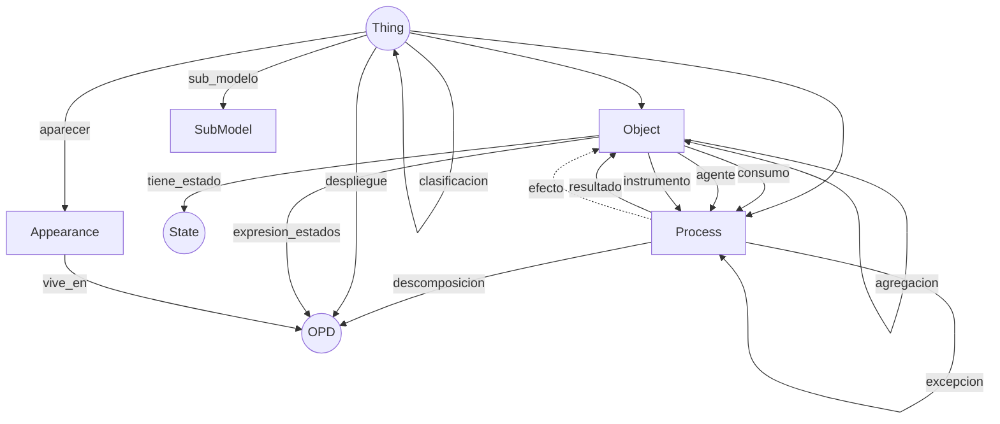
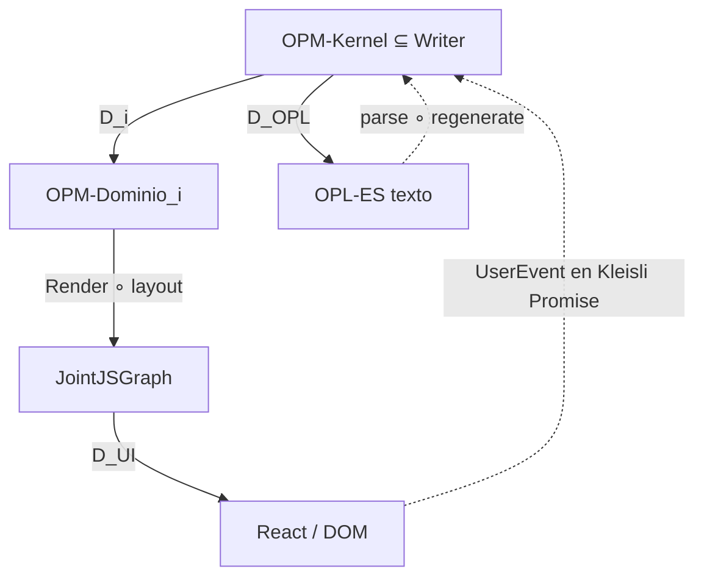

# 0. Guía de lectura

Este documento es la **constitución categórica** de `opm-model-app`: una herramienta de modelamiento OPM/ISO 19450 multidominio concebida para ser, desde el día 0, estructuralmente superior a OPCloud.

> **Axioma de diseño** (invariante único de toda la arquitectura)
>
> **Arquitectura = composición correcta de partes que preservan estructura.**
>
> Toda decisión se evalúa contra tres criterios:
> 1. **Compone** (asociatividad + identidad se satisfacen),
> 2. **Preserva** (cada traducción entre mundos es un funtor con `faithfulness/fullness` declarada), y
> 3. **Es universal** (la solución satisface una propiedad universal: límite, colímite, adjunción o extensión de Kan).
>
> Lo que no compone, no preserva o no es universal, es **deuda arquitectónica con nombre categórico**.

## Cómo leer este documento

- El lector objetivo (Felix, operador) **no domina teoría de categorías**. Cada término técnico se explica en su primera aparición con un ejemplo del dominio OPM o de alguno de los cinco dominios target.
- Cada sección tiene tres partes: (a) la estructura formal, (b) el **mapping operativo** a TypeScript/JointJS/SSOT, y (c) la traza al corpus ICAS-BoK que la fundamenta.
- Los diagramas Mermaid acompañan al texto, no lo reemplazan. Si un diagrama y el texto discrepan, prevalece el texto.
- Se declaran explícitamente las **pérdidas de información** (funtores no plenos, no fieles) donde aplican. Honestidad radical: si algo no cierra, se dice.

## Mapa general

```
  ┌─────────────────────────────────────────────────────────────────┐
  │   1. Axioma & tríada de verificación                            │
  ├─────────────────────────────────────────────────────────────────┤
  │   2. Categoría OPM-Kernel (presentación finita)                 │
  │      ecuaciones del SSOT como constraints categóricas           │
  ├─────────────────────────────────────────────────────────────────┤
  │   3. Par adjunto Entidad ⊣ Apariencia (cornerstone Darwin V2.3) │
  ├─────────────────────────────────────────────────────────────────┤
  │   4. 2-categoría de dominios                                    │
  │      5 funtores D_i : OPM-Kernel → OPM-Dominio_i                │
  │      (HDOS, OpenClaw, KORA, HSC, GOREOS)                        │
  ├─────────────────────────────────────────────────────────────────┤
  │   5. Arquitectura en capas como composición de funtores         │
  │      Kernel → Dominio → Render → UI, con mónadas de efectos     │
  ├─────────────────────────────────────────────────────────────────┤
  │   6. Bidireccionalidad Canvas ↔ OPL como lente dependiente      │
  ├─────────────────────────────────────────────────────────────────┤
  │   7. Siete patrones cruzados formalizados                       │
  ├─────────────────────────────────────────────────────────────────┤
  │   8. Mapping operativo a TS/JointJS                             │
  ├─────────────────────────────────────────────────────────────────┤
  │   9. Tests de derivabilidad por dominio                         │
  ├─────────────────────────────────────────────────────────────────┤
  │  10. Pérdidas declaradas                                        │
  ├─────────────────────────────────────────────────────────────────┤
  │  11. Traza completa al corpus                                   │
  ├─────────────────────────────────────────────────────────────────┤
  │  12. Self-check fundacional                                     │
  └─────────────────────────────────────────────────────────────────┘
```

## 0.1 Estado operativo — etiquetas de implementación

Este documento declara una constitución que cubre dos horizontes: lo que el
código ya ejecuta hoy y lo que está formalizado como destino futuro. Para
evitar confundir aspiración con contrato vigente, cada construcción
categórica tiene una de tres etiquetas:

| Etiqueta | Significado | Criterio |
|---|---|---|
| **[EJECUTADO]** | Presente en el código con ley ejecutable o test automatizado. | Hay módulo TS y/o aserción en `tests/laws.ts` o snapshots. |
| **[DIFERIDO]** | Formalización esperada; trigger operativo declarado en BACKLOG. | Tiene entrada `FEAT-N` o `DEUDA-N` con prioridad y trigger. |
| **[ASPIRACIONAL]** | Construcción nombrada, sin módulo ni trigger activo. | Guía conceptual; no contrato. |

### Mapa de estado al 2026-04-22

| Construcción | Estado | Evidencia / trigger |
|---|---|---|
| Categoría `OPM-Kernel` como presentación finita | **[EJECUTADO]** | `src/nucleo/tipos.ts`, `src/nucleo/enlaces.ts` (`ESPECIFICACIONES_ENLACE`) |
| Instancia `I : OPM-Kernel → Set` como funtor | **[EJECUTADO]** | `interface Modelo` con `Map`s; `tests/laws.ts` verifica roundtrip canónico |
| Coproducto `Thing ≅ Object + Process` | **[EJECUTADO]** | `TipoCosa = "objeto" \| "proceso"` (discriminated union) |
| Pullback `Apariencia = Thing ×_{shown_in} OPD` | **[EJECUTADO]** | `claveApariencia ${entidad}:${id}::${opd}`; `diagnosticarAparienciasLayouts` verifica invariante |
| Adjunción `Free ⊣ Forget` (Apariencia ↔ Entidad) | **[EJECUTADO]** | C-01/C-02: `Apariencia` discriminada + `Layout` separado; counidad en cascada de `eliminarCosa` |
| Funtor `D_Render : Modelo → JointJSGraph` | **[EJECUTADO]** | `src/render/jointjs/` + `RendererAdapter` abstracto |
| Lente dependiente Canvas ↔ Modelo | **[EJECUTADO] parcial** | Forward render + backward drag/rename/delete/picker operativos; `src/lente/lente-canvas.ts` concentra el backward Canvas → Operación y `tests/laws.ts` verifica PutGet/PutPut |
| Lente dependiente OPL ↔ Modelo | **[EJECUTADO] parcial** | `src/lente/lente-opl.ts` materializa forward + backward contextual; `src/ui/opl-panel.ts` aporta edición lateral; la edición OPL baja a operaciones atómicas del Writer en el subconjunto editable actual; `tests/laws.ts` verifica GetPut / PutGet / PutPut y conmutatividad con la ruta Writer sobre renombre global |
| Mónada Writer `<LogEvento>` | **[EJECUTADO] parcial** | `src/nucleo/log-evento.ts`, `aplicarConLog()`, `src/persistencia/eventos.ts`, wire-up UI, historial con cursor y `src/nucleo/replay.ts` (`reducir`/`rebobinar`) ya están ejecutados. Replay preserva `idCreado` y `tests/laws.ts` prueba su conmutatividad; queda parcial porque la gramática OPL y la cobertura inter-dominio siguen creciendo. |
| Coalgebra FSM (patrón P1) | **[ASPIRACIONAL]** | Ver §7.1. Trigger: primer dominio con FSM no trivial (probable D_HDOS). |
| Operad de OPDs (patrón P5) | **[ASPIRACIONAL]** | Ver §7.5. Árbol presentado por FK `opdPadre`; `arbolDeOpds()` no materializado. |
| Sheaf temporal + Reader `<Time>` (patrón P7) | **[ASPIRACIONAL]** | Ver §7.7. Post-MVP-1. |
| Schema versioning + migradores | **[DIFERIDO]** | ADR-001 fija estrategia; materializa cuando toque un campo del schema. |
| Sub-coalgebra de seguridad / safety | **[ASPIRACIONAL]** | Sin dominio con requerimiento activo. |

**Regla de lectura**: cuando el documento dice "este módulo..." en presente
indicativo, aplica sólo si la etiqueta es `[EJECUTADO]`. En otros casos es
prospecto, no contrato. El BACKLOG.md es la fuente de verdad para triggers y
prioridades; esta tabla solo lo refleja.

**Frontera vigente motor ↔ suite (ciclo 2026-04-23):** el motor reusable vive
en `src/nucleo/`, `src/render/`, `src/lente/`, `src/persistencia/` y la UI; las
instancias de dominio y correspondencias concretas viven en `src/suite/`.
La composición del producto y los tests pueden consumir `src/suite/`, pero el
motor no debe depender de una instancia concreta.

---

# 1. Axioma y tríada de verificación

## 1.1 El axioma

> **Arquitectura = composición correcta de partes que preservan estructura.**

En el contexto de `opm-model-app` esto significa:

- **Una cosa** (objeto o proceso OPM) no es una caja con atributos internos: es el **patrón de enlaces** que mantiene con otras cosas. Esta es la lección de Yoneda aplicada al modelo OPM.
- **Un funtor de dominio** `D_i : OPM-Kernel → OPM-Dominio_i` no es un "export": es una **traducción que preserva la composición de morfismos** — los enlaces del kernel se mapean a enlaces del dominio, y la composición de dos enlaces en el kernel es la composición de sus imágenes.
- **Un renderer JointJS** no es un "pintador": es un funtor `D_Render : OPM-Model → JointJSGraph` cuyas **pérdidas** (faithfulness/fullness) están declaradas.

## 1.2 La tríada de verificación

Cada construcción de este documento se somete a tres preguntas:

| Criterio | Pregunta operativa |
|---|---|
| **Compone** | ¿La asociatividad e identidad se satisfacen? ¿Puedo encadenar dos mutaciones del modelo sin ambigüedad? |
| **Preserva** | ¿Qué traducciones son funtores? ¿Qué se pierde en cada una y por qué? |
| **Es universal** | ¿La solución se deriva de una propiedad universal (pullback, pushout, adjunción), o es ad hoc? |

*Fundamentación:* `01-composicion.md`, `02-preservacion.md`, `05-universales.md`.

## 1.3 Distinción: dos categorías entran a escena desde el principio

Dos "categorías" conviven en este diseño, y nunca se confunden:

1. **`OPM-Kernel`**, la categoría **del modelo** (objetos OPM, enlaces como generadores, axiomas SSOT como ecuaciones). Es el "schema categórico" de OPM.
2. (~~La 2-categoría DomOPM de dominios específicos (KORA/HSC/HDOS/OpenClaw/GOREOS) y sus 1-morfismos~~) **Eliminada 2026-04-27** — los funtores de dominio fueron retirados como lastre tras la auditoría categorial.

La primera vive *dentro* del modelo. La segunda vive *alrededor* del modelo. Esta distinción es la base de la sección 4.

---

# 2. Categoría `OPM-Kernel`

## 2.1 Glosario mínimo (para el lector no categórico)

Antes de presentar el kernel, fijo cuatro términos operativos que reaparecerán:

| Término | Definición operativa | Ejemplo OPM |
|---|---|---|
| **Categoría** | Colección de objetos + morfismos (flechas dirigidas) entre ellos + composición asociativa con identidad | Objetos: `Cosa`, `Estado`, `OPD`. Morfismos: generadores `enlace`, `exhibe`, `refina`, ... |
| **Morfismo / Generador** | Flecha entre objetos; las ecuaciones dicen cuáles composiciones son iguales | `enlace-consumo : Cosa → Proceso` (según la convención ejecutable del kernel) |
| **Funtor** `F : C → D` | Mapeo que respeta composición e identidad: `F(g ∘ f) = F(g) ∘ F(f)` y `F(id_A) = id_F(A)` | `D_HDOS` lleva un `Proceso` del kernel a un `Proceso-HDOS` concreto (p.ej. `Ejecutar Visita`) |
| **Adjunción** `L ⊣ R` | Par de funtores `L : D → C` y `R : C → D` tal que `Hom_C(L d, c) ≅ Hom_D(d, R c)` de forma natural | `Apariencia ⊣ Entidad`: por cada "apariencia en OPD" hay una única "cosa en modelo" (§ 3) |

*Fundamentación:* `01-composicion.md` §"Objetos, morfismos, y las dos leyes"; `04-identidad-es-relacion.md` §"El momento en que todo cambia"; `06-adjunciones.md` §"La definición: unit y counit".

## 2.2 Presentación finita del kernel

`OPM-Kernel` es una **categoría finitamente presentada**: la declaro con un conjunto finito de objetos primitivos, un conjunto finito de generadores (morfismos) y un conjunto finito de ecuaciones (axiomas SSOT que deben valer en toda instancia del schema).

### 2.2.1 Objetos primitivos

```
Obj(OPM-Kernel) = {
  Thing,        -- cosa OPM (objeto | proceso)
  Object,       -- Thing con tipo == "objeto"
  Process,      -- Thing con tipo == "proceso"
  State,        -- estado de un Object (subobjeto)
  Link,         -- enlace reificado entre cosas
  Modifier,     -- modificador de control (evento/condición)
  OPD,          -- Object Process Diagram
  Appearance,   -- aparición de una Thing en un OPD (fibración π + layout)
  Fan,          -- abanico XOR/OR/AND sobre un grupo de enlaces
  Scenario,     -- conjunto de etiquetas de ruta definiendo una variante
  Assertion,    -- aserción (safety/liveness/correctness)
  Requirement,  -- requisito estereotipado
  Stereotype,   -- estereotipo aplicado a una cosa
  SubModel,     -- referencia a sub-modelo externo vía URI
  Model         -- modelo OPM completo
}
```

**Nota de construcción:** `Object` y `Process` se modelan como **subobjetos** de `Thing` vía el atributo discriminador `Thing.tipo ∈ {"objeto", "proceso"}`. Categóricamente, `Object >-> Thing` y `Process >-> Thing` son dos monomorfismos (inyecciones) cuya suma es `Thing`: `Thing ≅ Object + Process` (coproducto en `Set`). Esto codifica ISO 19450 §3.16/§3.76.

*Fundamentación SSOT:* `opm-iso-19450-es.md` §"Cosas: objetos y procesos" (3.76 Cosa, 3.39 Objeto, 3.58 Proceso); tabla 3.16.

### 2.2.2 Generadores (morfismos del kernel)

Los generadores están agrupados por familia canónica del SSOT (core §"Panorama de enlaces"). Cada generador es una flecha formal con dominio y codominio tipificado.

**Familia transformadora (3 generadores):**
```
consumo   : Object → Process        -- core §3.10; 3.77
resultado : Process → Object        -- core §3.64
efecto    : Process ↔ Object        -- core §3.15; par entrada/salida §3.27/§3.47
```

Nota sobre `efecto`: semánticamente es un **par** (entrada-salida) que se puede escindir (§ "Enlaces transformadores escindidos con estado especificado"). En la presentación del kernel lo tratamos como un morfismo con discriminador de dirección; en la capa de aplicación se expande a `efecto_entrada : Object → Process` y `efecto_salida : Process → Object`, siempre vinculados por ecuación.

**Familia habilitadora (2 generadores):**
```
agente      : Object → Process   -- §3.3; 3.17; habilitador humano
instrumento : Object → Process   -- §3.30; habilitador no humano
```

**Familia invocación (2 generadores):**
```
invocacion : Process → Process   -- §3.31
excepcion  : Process → Process   -- §3.79; enlace de duración-anómala
```

**Familia estructural fundamental (4 generadores):**
```
agregacion     : Whole → Part          -- §3.83 ↔ §3.33
exhibicion     : Exhibitor → Feature   -- §3.20 ↔ §3.21 (cruza Object→Process también)
generalizacion : General → Special     -- §3.24 ↔ §3.70 (herencia)
clasificacion  : Class → Instance      -- §3.7 ↔ §3.28
```

**Familia estructural etiquetada (1 generador paramétrico):**
```
etiquetado[L] : Thing → Thing          -- §3.72; L es el rótulo (string opaco)
```
Para cada rótulo `L ∈ Σ` (alfabeto libre de etiquetas), obtengo un generador distinto. Formalmente, el kernel libre está enriquecido por un espacio de nombres que introduce estos generadores como constantes — equivalente a pasar a la categoría libre sobre el grafo etiquetado.

**Refinamiento (5 generadores):**

El parche v2.3 P2 exige cinco mecanismos formalmente distintos:

```
descomposicion      : Process → OPD            -- in-zoom; §10.3; el proceso descomposicion el OPD hijo
despliegue          : Refinable → OPD          -- unfolding; §10.4 (agregación, exhibición, clasificación, generalización)
expresion_estados   : Object → OPD             -- §10.6; revela subconjunto de estados
clasificacion_unfold: Class → OPD              -- §8 familia estructural (cuarto mecanismo clásico)
sub_modelo          : Thing → SubModel         -- §23; composición inter-modelo
```

**Apariencia:**

```
aparecer : Thing × OPD → Appearance             -- P6; un morfismo del producto
                                                  al coproducto de apariencias
```
Se discute como adjunción completa en §3.

**Estados:**
```
tiene_estado : Object → State    -- estado como subobjeto con padre = Object
               (requerido: Object.conEstados == true)
```

**Abanico:**
```
miembros : Fan → Link^n          -- un fan tiene n ≥ 2 miembros (validador existente)
```

### 2.2.3 Ecuaciones (axiomas SSOT como constraints categóricas)

Una categoría finitamente presentada no es solo un grafo libre: tiene **ecuaciones** que declaran qué composiciones son iguales. Son las **path equivalences** de Spivak (`02-preservacion.md` §"El patron schema/instancia"). Traducen los axiomas del SSOT en constraints estructurales que toda instancia válida debe satisfacer.

Cada ecuación se cita con su fuente SSOT.

**E1. Aridad de cosas en un OPD (V-54, §15.1):**
`Un OPDConstruct requires ≥ 2 Things` no es una ecuación de composición sino una **constraint cardinal** sobre los generadores. Formalmente: el funtor instancia `I : OPM-Kernel → Set` debe satisfacer `|{ Thing · Appearance(Thing, opd) ≠ ∅ }| ≥ 2` para todo OPD no-vacío. Esto corresponde a un **subobject classifier** en el topos de instancias.

**E2. Estado como subobjeto estricto (§3.68, §10.6):**
```
tiene_estado : Object → State   cumple   padre(State) = Object
```
En toda instancia, el objeto padre de un State DEBE ser un `Object` (no un `Process`). Esto es un monomorfismo reificado en el schema. Corresponde a la ecuación:
```
padre ∘ tiene_estado = id_Object   (la clase padre de un State devuelto es el mismo Object).
```
SSOT: `opm-iso-19450-es.md` "No hay estados de proceso".

**E3. Exhibición como único enlace estructural heterogéneo (§3.20):**
```
exhibicion puede tener dominio Object o Process, y codominio Object o Process.
```
Todos los demás enlaces estructurales fundamentales requieren misma perseverancia (E4). Esto se traduce en una ecuación de tipificación cruzada.

**E4. Perseverancia preservada por refinamiento estructural (§"Restricción de perseverancia"):**
```
∀ f : X → Y  generador estructural fundamental con f ≠ exhibicion:
    perseverancia(X) = perseverancia(Y).
```
Operativamente: `agregacion(Objeto) → Objeto` es válido; `agregacion(Objeto) → Proceso` no lo es.

**E5. In-zoom impone orden temporal (§"Árboles OPD y control implícito", §"Invocación implícita"):**
```
descomposicion : Process → OPD   induce un orden parcial sobre subprocesos.
```
Formalmente, el OPD hijo vive en la **categoría slice** `Procesos/Process_padre`, y el orden vertical de las elipses da un preorden temporal. La invocación implícita es la composición lineal en ese preorden.

**E6. Tres tipos de unfolds formalmente distintos (§10.4, §10.6, P2):**
```
despliegue (estructural)    ≠ expresion_estados (revela States) ≠ descomposicion (in-zoom)
```
Cada mecanismo es un generador distinto. La SSOT v2.3 amplía a 5 mecanismos (incluyendo `sub_modelo`, P2). No hay composición que identifique dos mecanismos diferentes salvo el isomorfismo trivial.

**E7. Conjunto previo / posterior del proceso (§"Control evento-condición-acción"):**
```
Pre(P)  = { x : consumo(P,x) ∨ efecto_entrada(x,P) ∨ agente(x,P) ∨ instrumento(x,P) }
Post(P) = { x : resultado(P,x) ∨ efecto_salida(P,x) ∨ efecto_entrada(x,P) }
```
Los `Event Modifier` se aplican solo a flechas cuyo destino está en `Pre(P)`: `resultado` no admite modificador de evento ni de condición (§414). Esta es una ecuación sobre el subobjeto `Modifier >-> Link`.

**E8. Resultado no admite modificador de evento/condición (§414):**
```
modificador(link, tipo="evento") ∧ tipoEnlace(link) == "resultado"  ⟹  ⊥
```
Ecuación booleana sobre el subobjeto de modificadores aplicables.

**E9. Exhibición es el único enlace estructural heterogéneo (§3.20, §"Exhibición-caracterización"):**
Ya declarado en E3; se repite aquí como recordatorio de que `exhibicion` puede conectar Object↔Process (atributo vs operación).

**E10. Identidad persistente es invariante por layout (P3, V-247/V-248/V-249):**
```
Los identificadores persistentes (IdPersistente) son estables bajo:
  - reordenamiento del árbol OPD
  - renumeración de etiquetas SDx.y
  - cambios de layout
```
Operativamente: el morfismo identidad `id : Thing → Thing` en el kernel *es* `IdPersistente`. Ninguna designación derivada del layout puede sustituirlo (§"Etiquetas OPD y navegación").

**E11. Sub-modelo como mecanismo de refinamiento (P7, §23, V-242):**
```
sub_modelo : Thing → SubModel  es un generador distinto de los 4 mecanismos clásicos.
La SubModel trae su propia frontera de serialización y URI estable.
```

**E12. Identificación visual = identidad estricta del kernel NO se cumple (V-123 reescrita, P6):**
Muy importante: dos apariencias de la misma Thing en dos OPDs distintos NO son el mismo objeto categórico en la categoría de apariencias. La ecuación:
```
¬( Appearance(thing, opd_1) = Appearance(thing, opd_2) )  en general.
```
Son **dos objetos distintos** con la misma pre-imagen en el funtor `forget : Appearance → Thing`. Esta asimetría es el germen de la adjunción de §3.

**E13. Precedencia de enlaces en recomposición (§"Precedencia de enlaces durante la recomposición"):**
Cuando un sub-proceso migra a su proceso padre por recomposición, la "fuerza semántica" ordena enlaces competidores:
```
consumo = resultado > efecto > agente > instrumento
```
Esta es una **ecuación de selección** en el funtor de recomposición (detallada en § 5.3).

### 2.2.4 Instancia del kernel como funtor

Una **instancia del modelo OPM** es un funtor `I : OPM-Kernel → Set` que:

- A cada objeto primitivo le asigna un conjunto (sus individuos: `I(Thing)` = conjunto de cosas del modelo, `I(Link)` = conjunto de enlaces, etc.).
- A cada generador le asigna una función entre esos conjuntos.
- Satisface todas las ecuaciones E1–E13.

Esto es exactamente la definición de Spivak: un schema DB es una categoría finitamente presentada, una instancia es un funtor a `Set`, y la integridad referencial es consecuencia de la functorialidad.

**Mapping operativo:** El `interface Modelo` en `src/nucleo/tipos.ts` **ES** el tipo de este funtor instancia. Cada `Map<IdPersistente, X>` en `Modelo` es la asignación `I(X)`; cada campo de `Enlace`, `Apariencia`, etc., es la imagen de un generador.

*Fundamentación:* `02-preservacion.md` §"El patron schema/instancia"; `01-composicion.md` §"Lo que veo cuando miro flechas" (niveles 1-4 de abstracción).

### 2.2.5 Diagrama del kernel (vista sinóptica)



Las líneas punteadas (`efecto`) denotan enlaces bidireccionales con par entrada/salida. El diagrama no lista estados, modificadores, abanicos ni requisitos por claridad visual.

### 2.2.6 Observación crítica sobre composición de Enlaces

El núcleo TypeScript actual observa (acertadamente, línea 333 de `tipos.ts`):

> Los enlaces NO componen categoriamente (no hay `f:A→B ∘ g:B→C = h:A→C`). Son relaciones tipificadas entre objetos y procesos, no flechas en una categoría libre.

Esto es **correcto como advertencia práctica**, pero **incompleto categóricamente**. La lectura exacta es:

- `Link` como **entidad reificada** (con `id`, `modificadores`, `etiquetaRuta`) no es una flecha; es un objeto primitivo del kernel (como en ISO 19450 `Link` es §3.36, un elemento).
- `Link` como **morfismo abstracto** sí compone, pero las composiciones van a categorías distintas según la familia: la composición de dos `enlaces procedimentales` vía una `Cosa` intermedia es la composición en la **free category** sobre el grafo del modelo (modulo ecuaciones).

El kernel mantiene ambas lecturas: `Link` como objeto (para borrado en cascada, anotación, layout) y como morfismo (para razonamiento sobre flujo, precedencia §E13, escisión §"Enlaces transformadores escindidos"). Esto es una **dualidad práctica**, no una contradicción.

*Fundamentación:* `01-composicion.md` §"Objetos, morfismos, y las dos leyes"; `09-efectos.md` §"El problema de las funciones que mienten" (reificación como táctica cuando la composición pura no basta).

---

# 3. Entidad ⊣ Apariencia: el par adjunto canónico

## 3.1 La observación Darwin V2.3

La observación más importante del reverse de OPCloud y de las vueltas Darwin (`docs/archive/2026-04/notas-darwin-sandbox-2026-04-18.md` §"Modelo de datos entidad↔apariencia"):

> Un `Thing` es entidad única a nivel modelo, pero puede tener múltiples apariencias visuales (`Appearance`) distribuidas en distintos OPDs.

OPCloud lo resuelve como parche `bolted-on`: una tabla de apariencias con FK a Things. **Nuestro diseño lo resuelve como adjunción**, lo que entrega garantías categóricas gratis (preservación de límites, propiedad universal, consistencia automática).

## 3.2 Construcción formal

Defino dos categorías auxiliares:

- **`EntCat`** (Categoría de Entidades): objetos son `Thing`s del modelo (con su `IdPersistente`). Morfismos son los enlaces del kernel (§2.2.2). Es el kernel semántico puro, **sin aparición visual**.
- **`AppCat`** (Categoría de Apariencias): objetos son pares `(Thing, OPD)`; un objeto de `AppCat` es "la apariencia de `t` en `opd`". Morfismos son enlaces **con layout** (con `vertices`, `etiquetaRuta`, etc.).

Estas son las dos capas de la dualidad **semántica vs. presentacional**.

Defino dos funtores entre ellas:

```
Forget : AppCat → EntCat        -- "olvida" layout y OPD; queda solo la Thing
Free   : EntCat → AppCat        -- "libremente" crea una apariencia en cada OPD
                                   donde la Thing tenga al menos una conexión
```

**Claim:** `Free ⊣ Forget` (Free es adjunto izquierdo de Forget).

**Unidad (η):** dada una Thing `t ∈ EntCat`, `η_t : t → Forget(Free(t))` es la identidad (la Thing olvidada de su apariencia libre es la Thing misma).

**Counidad (ε):** dada una apariencia `(t, opd) ∈ AppCat`, `ε_{(t,opd)} : Free(Forget(t, opd)) → (t, opd)` selecciona del conjunto libre de apariencias de `t` la que está efectivamente en `opd`.

**Isomorfismo de hom-sets:** `AppCat(Free(t), (t', opd)) ≅ EntCat(t, Forget(t', opd))`. Operativamente: "crear una apariencia de `t` en `opd`" equivale a "conectar `t` con `t'` en el modelo lógico"; la aparición se deriva.

### 3.2.1 Verificación operativa

Esta adjunción predice que:

1. **Eliminar una Thing debe cascada a todas sus apariencias** (consecuencia de que `Free` es adjunto izquierdo: preserva colímites → preserva inicialidades → la "no-existencia" se propaga).
2. **Editar el nombre de una Thing en una Apariencia edita la Thing** (consecuencia del isomorfismo de hom-sets: no hay "morfismo que cambie solo la apariencia sin tocar la entidad").
3. **Dos apariencias distintas de la misma Thing comparten identidad persistente** (consecuencia de `Forget` ser funtor: `Forget(t, opd_1) = Forget(t, opd_2) = t`).

Estas tres propiedades son exactamente las que OPCloud implementa como parche. En nuestro diseño se **derivan gratis** del par adjunto.

## 3.3 Precaución: no toda construcción Free/Forget es una adjunción pura

`06-adjunciones.md` §"Free/forgetful: el arquetipo" advierte explícitamente que en software lo que típicamente veo es un **patrón estructural** adjunto, no una adjunción exacta en el sentido matemático. Verifico la tríada:

| Propiedad | Status | Evidencia |
|---|---|---|
| Compone | Sí | `Forget ∘ Free = Id_EntCat` se verifica en el código por construcción (el `Modelo` mantiene `cosas` y `apariencias` como Maps indexados) |
| Preserva | Sí (con pérdida declarada) | `Forget` es **fiel** (dos apariencias distintas con el mismo Thing tienen morfismos de origen/destino distinguibles) pero **no pleno** (no todo morfismo en `EntCat` tiene contraparte visual directa — hay enlaces del modelo sin layout aún) |
| Es universal | Sí | El isomorfismo de hom-sets se satisface por la construcción de `apariencias : Map<ClaveApariencia, Apariencia>` con clave nominal estructurada `apariencia:["entidad","id",instancia|null,"opd"]` (`serializacion.ts`) |

**Pérdida declarada:** `Forget` es fiel pero no pleno. Un enlace puede existir en el modelo sin tener visualización en algún OPD específico (apariencia parcial). Esta pérdida es **aceptable y necesaria** para el modo "vista ad hoc" (TipoOpd `vista_ad_hoc`).

## 3.4 Mapping operativo

### 3.4.1 En la estructura de datos actual (`src/nucleo/tipos.ts`)

La adjunción ya está presente en embrión:

```ts
// src/nucleo/tipos.ts

interface Cosa {
  id: IdPersistente;       // La Thing única — objeto en EntCat
  tipo: TipoCosa;
  nombre: string;
  // ... atributos semánticos
}

interface Apariencia {
  cosa: IdPersistente;     // π: Appearance → Thing (el Forget funtor)
  opd: IdPersistente;
  x, y, w, h: number;      // layout
  interno?, fijada?, ...   // atributos presentacionales
  modo?: "local" | "referencia_externa";  // P6 V-123
  referenciaExterna?: ...  // cross-model
}

interface Modelo {
  cosas: Map<IdPersistente, Cosa>;       // I(Thing) — objeto de EntCat
  apariencias: Map<ClaveApariencia, Apariencia>; // I(Appearance)
                                                  // clave nominal estructurada
  // ...
}
```

Las claves nominales estructuradas `apariencia:["entidad","id",instancia|null,"opd"]` son, literalmente, el producto fibrado `Thing × OPD` refinado por fibra visual opcional sobre el elemento específico donde la apariencia existe. Esto es un **pullback** en el sentido de `05-universales.md` §"Pullbacks: el JOIN categórico":

```
Appearance = Thing ×_{shown_in} OPD
           = {(t, opd) ∈ Thing × OPD : t aparece en opd}
```

### 3.4.2 Operaciones derivadas de la adjunción

Tres operaciones del modelador se derivan de la adjunción:

| Operación UI | Construcción categórica | Mapping TS |
|---|---|---|
| "Crear cosa X en el OPD actual" | Aplicar `Free`, instanciar la counidad `ε_{(X, opd_actual)}` | `aplicar(crearCosa)` → `aplicar(crearApariencia)` en cascada |
| "Eliminar la apariencia de X en este OPD (sin eliminar X del modelo)" | Quitar del codominio `(X, opd)`; la Thing permanece | `aplicar(eliminarApariencia)` solo toca el Map `apariencias` |
| "Eliminar X del modelo" | Operación en `EntCat` → el adjunto izquierdo propaga: todas las apariencias desaparecen | `aplicar(eliminarCosa)` debe cascada a apariencias (verificar que existe) |

### 3.4.3 Recomendación estructural

El kernel actual ya soporta esta adjunción. **Recomendación:** añadir una operación atómica `eliminarCosaConCascada` y una prueba de la counidad en el validador: toda `Apariencia.cosa` debe existir en `Modelo.cosas` (ya implementado parcialmente en `validacion.ts` líneas 149-151).

*Fundamentación:* `06-adjunciones.md` §"La definición equivalente: isomorfismo de hom-sets"; `06-adjunciones.md` §"Free/forgetful: el arquetipo"; `docs/archive/2026-04/notas-darwin-sandbox-2026-04-18.md` §"Modelo de datos entidad↔apariencia".

# 5. Arquitectura en capas como composición de funtores

## 5.1 Las cuatro capas

El flujo operativo de `opm-model-app` se descompone en cuatro capas, conectadas por funtores:

```
[1] OPM-Kernel   ─── D_i ───►   [2] Dominio OPM (HDOS|OpenClaw|KORA|HSC|GOREOS)
      │                                    │
      │                                    │ D_Render
      │                                    ▼
      │                          [3] JointJSGraph (cells)
      │                                    │
      │                                    │ D_UI
      │                                    ▼
      │                          [4] React/DOM
      │                                    │
      │  apliación ida-y-vuelta            │ D_OPL
      └────── D_OPL ────────────►  [OPL-ES texto]
```

Las capas 1→2→3 son **composición funtorial pura**. La capa 4 introduce **mónadas de efectos** (user input, render side effects, persistencia).

## 5.2 Composición funtorial pura: `OPM-Kernel → JointJSGraph`

Para cada dominio `i` defino:

```
Render_i : D_i(OPM-Kernel) → JointJSGraph
         = Render ∘ D_i   (composición de funtores)
```

donde `Render : OPM-Kernel → JointJSGraph` es el funtor genérico de renderizado (común a todos los dominios).

**Verificación operativa:** Por functorialidad de la composición, si dos mutaciones conmutan en el kernel, sus renderings conmutan en JointJS. Esto predice que **el orden de aplicación de operaciones atómicas en el canvas no afecta el resultado final** siempre que las operaciones sean composables en el kernel.

## 5.3 Mónadas de efectos: las tres capas con efectos

Siguiendo `09-efectos.md`, identifico tres mónadas canónicas:

### 5.3.1 Mónada de persistencia: `Writer<LogEvento>` **[EJECUTADO] parcial**

> **Estado**: materializada y cableada en la Capa 2.5 del ADR-003.
> Hoy existen `src/nucleo/log-evento.ts`, `aplicarConLog()` en
> `src/nucleo/aplicador.ts`, `src/persistencia/eventos.ts`, el replay
> `src/nucleo/replay.ts` (`reducir` / `rebobinar`), historial con cursor en
> `src/main.ts`, undo/redo en la UI y la ruta OPL→Writer para el subconjunto
> textual hoy soportado. Replay ya preserva `idCreado` y `tests/laws.ts`
> prueba explícitamente que `reducir(M, eventos)` conmuta con la composición
> secuencial original de operaciones.

La formalización ideal: toda mutación del modelo produce un evento auditable
(brief §P4 "Eventos como fuente de verdad auditable"). Formalmente:

```ts
type Mutacion<T> = (modelo: Modelo) => [Modelo, LogEvento[], T]
```

Esto es la **mónada Writer** donde el acumulador es un monoide `LogEvento[]` con concatenación. La composición de dos mutaciones concatena sus logs.

**Implementación vigente:** `aplicarConLog(op, modelo, reloj)` devuelve
`{ modelo, eventos, idCreado? }` sobre el mismo `Resultado<T, E>` del núcleo.
La composición observada hoy es `Resultado × Writer`, con reloj inyectable para
tests deterministas. El paso pendiente ya no es el wire-up base, sino ampliar la
superficie de mutaciones textuales/dominio que descienden a operaciones atómicas.

Ver §7 (patrón P4) para formalización completa.

### 5.3.2 Mónada de interacción: `IO<UserEvent>`

Los eventos del canvas (click, drag, drop, edit) son una mónada `IO`: encapsulan efectos del mundo externo. JointJS los expone como callbacks; debemos encapsularlos en un wrapper monádico para componer pipelines "click → validar → aplicar → re-renderizar".

**Implementación recomendada:** un `EventHandler<T>` como categoría de Kleisli sobre la mónada `Promise` (async IO en TS). Cada handler es un morfismo `UserEvent → Promise<Resultado<Modelo>>`.

### 5.3.3 Mónada de renderizado: efectos de DOM

El renderer JointJS opera sobre el DOM. Sus efectos son **idempotentes** (renderizar dos veces el mismo modelo produce el mismo DOM). Esto permite tratar el renderer como **puro a nivel categórico** (un funtor `D_Render`) aunque internamente use side effects.

**Nota categórica:** esta idempotencia es lo que permite aplicar las tres R de React (reconciliación): el renderer es un **morfismo coalgebraico** `Modelo → JointJSGraph` cuya composición con sí mismo es idempotente.

*Fundamentación:* `09-efectos.md` §"Catálogo de monadas concretas"; `09-efectos.md` §"La categoria de Kleisli".

## 5.4 Diagrama conmutativo de capas



Las aristas punteadas son **backward arrows** del lente (§6): transforman eventos/texto en mutaciones del kernel.

## 5.5 Conmutatividad requerida

Las siguientes conmutaciones **deben** verificarse como tests:

1. **Renderer invariante por composición de mutaciones:** `Render(aplicar(m_2) ∘ aplicar(m_1)(M)) = Render(aplicar(m_2)(aplicar(m_1)(M)))` — el diagrama de mutaciones encadenadas conmuta con el render.
2. **OPL reversible para mutaciones estructurales:** `parse(regenerate(M)) = M` módulo layout (faithful, no pleno — ver §10).
3. **Eventos emitidos = composición de Writers:** si `m_1` emite `[e_1]` y `m_2` emite `[e_2]`, entonces `m_2 ∘ m_1` emite `[e_1, e_2]` (concatenación del monoide).

Estas conmutatividades son **teoremas**, no esperanzas. Cualquier violación es un bug categórico reportable.

*Fundamentación:* `01-composicion.md` §"Diagramas conmutativos: el lenguaje del razonamiento"; `07-composicion-con-estructura.md` §"String diagrams: el lenguaje nativo".

---

# 6. Bidireccionalidad Canvas ↔ OPL como lente dependiente

## 6.1 El problema

OPM es un lenguaje **bimodal** (SSOT §"Representación bimodal"): todo modelo se expresa en dos formas equivalentes — OPD (gráfico) y OPL-ES (textual). Las dos son canónicamente intercambiables.

Lo que en la práctica significa:
- El usuario dibuja en el canvas → el OPL se actualiza.
- El usuario edita el OPL → el canvas se actualiza.

Esta bidireccionalidad **no es** un isomorfismo (hay información de layout en el canvas que no está en el OPL). Es una **lente dependiente**.

## 6.2 Formalización

Siguiendo `11-interaccion.md` §"Lentes dependientes: morfismos en Poly":

Defino dos "mundos":
- **Mundo Modelo:** los modelos OPM (categoría `OPM-Models`).
- **Mundo OPL:** los textos OPL-ES (categoría `OPL-Texts`).

Una **lente dependiente** `ℓ : Modelo ⇄ OPL` consta de:
- **Forward** `ℓ_→ : Modelo → OPL` (renderiza modelo a OPL).
- **Backward dependiente** `ℓ_←_M : OPL_parched → Modelo` que depende del modelo `M` actual (para no perder layout ni apariencias ad-hoc cuando el parche del OPL es local).

### 6.2.1 Ley de la lente

Debe satisfacer las **leyes de la lente** (de [Oleg Kiselyov, van Laarhoven]):

1. **GetPut:** `ℓ_←_M(ℓ_→(M)) = M`. Renderizar y volver a parsear da el mismo modelo.
2. **PutGet:** `ℓ_→(ℓ_←_M(t)) = t`. Parsear un texto y volver a renderizarlo da el mismo texto.
3. **PutPut:** `ℓ_←_{ℓ_←_M(t_1)}(t_2) = ℓ_←_M(t_2)`. Dos ediciones seguidas del OPL se componen correctamente.

**Nota honesta:** GetPut y PutGet se satisfacen sobre el **subconjunto semántico** del modelo; no sobre el layout. Es decir, `ℓ_←_M` preserva `cosas`, `enlaces`, etc., pero el layout **se regenera** si la información está ausente. Esto es inevitable: el OPL no codifica posiciones.

### 6.2.2 Formalización como polynomial lens

Como polinomio:
```
p = OPL-snippet × y^{Modelo-context}
q = Modelo × y^{Modelo}
```

La función on-positions `p_1 → q_1` es el parser. La función on-directions `q[M] → p[opl]` es el renderer **dependiente del modelo** para preservar layout y marks contextuales.

## 6.3 Mapping operativo

### 6.3.1 Arquitectura TS propuesta

```ts
// src/lente/lente-opl.ts

type Lente = {
  // Forward: Modelo → OPL visible
  renderizar(modelo: Modelo, filtro?: { ids?: IdPersistente[] }): SentenciaOPL[];
  renderizarTexto(modelo: Modelo, filtro?: { ids?: IdPersistente[] }): string;

  // Backward dependiente: parche textual + modelo actual (+ contexto visible)
  parsear(
    opl: string,
    modeloActual: Modelo,
    contexto?: readonly SentenciaOPL[],
  ): Resultado<Modelo, readonly ErrorOPL[]>;
};

// Leyes ejecutadas en tests/laws.ts:
// assert: parsear(renderizarTexto(M), M) ≅ M               // GetPut (módulo meta.modificado)
// assert: renderizarTexto(parsear(t, M).ok) ≅ t            // PutGet (módulo reordenamiento canónico)
// assert: parsear(t_2, parsear(t_1, M).ok) = parsear(t_2, M) // PutPut
```

### 6.3.2 Estado actual del kernel

La implementación vigente ya materializa esta arquitectura en dos piezas:
- `src/lente/lente-opl.ts` — forward + backward contextual sobre el subconjunto editable emitido por `src/render/opl-renderer.ts`.
- `src/ui/opl-panel.ts` — panel lateral de edición textual, filtrado por selección canvas y sin hardcodeo visual dentro del OPD.

Las tres leyes quedan verificadas en `tests/laws.ts` sobre el subconjunto ejecutado hoy (roundtrip canónico y renombre global coherente).

### 6.3.3 Bidireccionalidad Canvas ↔ Modelo como la misma lente

Exactamente el mismo patrón aplica al canvas JointJS:
- `renderizarAJointJS(modelo)` — forward.
- `aplicarGesto(gesto, modelo)` — backward dependiente.

El único cambio es el dominio del polinomio (gestos en vez de OPL snippets). La estructura formal es idéntica.

*Fundamentación:* `11-interaccion.md` §"Lentes dependientes: morfismos en Poly"; `11-interaccion.md` §"Optics: acceso bidireccional generalizado"; `09-efectos.md` §"Leyes distributivas: cuando los efectos componen".

---

# 7. Siete patrones cruzados formalizados

El brief (§ "Patrones cruzados detectados") identifica 7 patrones invariantes. Aquí los formalizo uno a uno, con construcción categórica y mapping TS.

## 7.1 P1. FSM universal — Coalgebra de transición **[ASPIRACIONAL]**

### Observación
Todos los dominios modelan estados finitos sobre sus Objects clave: Estadia (HDOS), Agent (OpenClaw), Artefacto (KORA), Encounter (HSC), IPR (GOREOS). Transiciones auditadas, no mutación silenciosa.

### Construcción categórica

Una **F-coalgebra** es un par `(S, α)` donde `α : S → F(S)` es un observador: dado el estado, produce la próxima observación (transición).

Para OPM:
```
F(S) = Evento × S + Evento    -- un estado produce un Evento y transita a otro estado,
                                 o termina (estado final)
α : ObjetoConEstados → F(ObjetoConEstados)
```

Dos Objects con el mismo comportamiento externo son **bisimilares** (`09-efectos.md` §"Bisimulación: equivalencia observacional"). La equivalencia observacional es el criterio para comparar dos implementaciones de un FSM de dominio (ej. dos versiones de la FSM de Visita).

### Mapping TS

El kernel actual ya soporta Estado (`interface Estado`) con designaciones `inicial`, `final`, `porDefecto`, `actualPersistente`, `actualRuntime`. Falta el álgebra de transición explícito. Propuesta:

```ts
// src/nucleo/fsm.ts  (nuevo módulo)

export interface Transicion {
  desde: IdPersistente;   // Estado
  hasta: IdPersistente;   // Estado
  trigger: { tipo: "evento" | "condición" | "temporal"; evento?: string };
  accion?: string;         // OPL de la acción (opcional)
}

export interface FSM {
  objeto: IdPersistente;    // Object con conEstados == true
  transiciones: Transicion[];
}

// Coalgebra: dado un objeto con estado actual, produce próxima transición posible
export function proximaTransicion(
  fsm: FSM,
  estadoActual: IdPersistente,
  eventoEntrada: string
): Transicion | null;
```

Esto es la coalgebra `α` explícita.

*Fundamentación:* `09-efectos.md` §"Coalgebras: la mirada desde afuera"; §"Bisimulación: equivalencia observacional".

## 7.2 P2. Entidad ↔ Aparición — Ya formalizado como adjunción canónica (§3) **[EJECUTADO]**

Ver §3 completa. Construcción: `Free ⊣ Forget`. Evidencia Darwin V2.3 en `docs/archive/2026-04/notas-darwin-sandbox-2026-04-18.md`.

## 7.3 P3. Provenance / URN / identidad canónica — Mónada Writer + content-addressing **[DIFERIDO — FEAT-03]**

### Observación
KORA: URN. HSC: logical_key idempotente. HDOS: triggers PE-1. GOREOS: categorical univocity.

### Construcción categórica

Dos construcciones en una:

**(a) Mónada Writer** (`09-efectos.md` §"Catálogo de monadas concretas"):
```
Writer<Provenance><T> = (T, Provenance)
return(x) = (x, ε)
(x, p) >>= f = let (y, p') = f(x) in (y, p <> p')
```

Toda operación que produce un `T` también produce una provenance. La provenance forma un **monoide** con concatenación.

**(b) Content-addressed identity:**
Para HSC, el `IdPersistente` se **deriva** del contenido: `hash(brick_type || source || encounter || content_hash)`. Es una **función de Kuratowski** (identidad extensional, no intencional).

Ambas se combinan: toda operación del kernel produce `(Modelo', Provenance[])` y el `IdPersistente` de nuevos elementos puede ser content-addressed opcional (elegible por dominio).

### Mapping TS

```ts
// src/nucleo/provenance.ts  (nuevo módulo)

export interface Provenance {
  sistema: string;           // "HSC-ingester", "GOREOS-CGR", etc.
  confianza?: number;        // [0, 1]
  timestamp: string;
  operador?: string;         // persona o agente
  evento: string;            // código de evento (13 códigos de GOREOS, etc.)
  hashFuenteDato?: string;   // para content-addressing
}

// Writer monad sobre Provenance
export type ConProvenance<T> = {
  valor: T;
  provenance: Provenance[];  // monoide: concat
};

// Extensión del Resultado existente
export type ResultadoConProvenance<T, E> =
  | { ok: true; valor: T; provenance: Provenance[] }
  | { ok: false; error: E; provenance: Provenance[] };
```

### Verificación
- **Compone:** concatenación de arrays es asociativa con `[]` como identidad. ✓
- **Preserva:** funtor Writer preserva composición e identidad. ✓
- **Es universal:** el monoide libre sobre eventos es el adjunto izquierdo del funtor que olvida estructura monoidal. ✓

*Fundamentación:* `09-efectos.md` §"Catálogo de monadas concretas" (Writer); `06-adjunciones.md` §"Free/forgetful" (monoide libre).

## 7.4 P4. Event sourcing — Sheaf temporal + mónada State **[DIFERIDO — FEAT-07]**

### Observación
HDOS: `transition_*()` + event. OpenClaw: `sessions_history`. KORA: `_transmutation.yml` proof-carrying. HSC: `revision++`. GOREOS: `txn.event` + Soft Delete.

### Construcción categórica

**Sheaf temporal** (`15-tiempo.md` §"Behavior types como sheaves"):

El event log es un **sheaf sobre el site de intervalos `IR`**: para cada duración `l`, `EventLog(l)` = conjunto de secuencias de eventos en esa ventana. El restriction map toma un log largo y lo restringe a un sub-intervalo. La condición de sheaf dice que logs solapados que coinciden en el solapamiento **pegan** a un log único.

**Mónada State** (`09-efectos.md` §"Catálogo de monadas concretas"):
```
State<Modelo><T> = Modelo → (T, Modelo)
```

Una mutación es `mutacion : Comando → State<Modelo><LogEvento[]>`. Aplicar secuencialmente es composición en Kleisli.

La composición de ambas: **Writer × State = Event-sourced mutation**. Cada mutación lee el estado, produce nuevo estado y un log.

### Mapping TS

```ts
// src/nucleo/aplicador.ts ya tiene la estructura base.
// Extensión propuesta:

export type EventSourcedMutation<T> = (
  modelo: Modelo
) => {
  modelo: Modelo;
  eventos: LogEvento[];
  valor: T;
};

// Replay: construir Modelo a partir de log
export function replay(
  eventos: LogEvento[]
): Modelo;

// Snapshot: serialización eficiente de estado
export function snapshot(modelo: Modelo): {
  modelo: Modelo;
  desde: LogEvento;  // último evento aplicado
};
```

### Verificación: la condición de sheaf

Dados dos logs `L_1` sobre `[t_0, t_2]` y `L_2` sobre `[t_1, t_3]` con `t_1 < t_2`, si coinciden en `[t_1, t_2]`, se pegan a un log único sobre `[t_0, t_3]`. Esta es la condición de **pegado** del sheaf. En código: implementar `mergeEventLogs(L1, L2)` que verifique compatibilidad en el solape y falle ruidosamente si no la hay.

*Fundamentación:* `15-tiempo.md` §"Behavior types como sheaves"; `15-tiempo.md` §"Todo converge aqui" ("El event log de un sistema event-sourced se deja modelar de forma natural como un tipo de comportamiento"); `09-efectos.md` §"State monad".

## 7.5 P5. Composición jerárquica — Operad de OPDs **[ASPIRACIONAL]**

### Observación
OpenClaw: Gateway→Agent→Skill→Session. KORA: KB→Namespace→Artefacto→Proposición. GOREOS: IPR→Commitment/Agreement/Problem. HDOS: Estadia→Visita→Documentación. HSC: Patient→Encounter→Brick.

### Construcción categórica

**Operad** (`13-escala.md` §"Operads: composición jerárquica"):

Una operada `OpdOp` tiene:
- Para cada aridad `n ≥ 0`, un conjunto de operaciones que anidan `n` OPDs dentro de uno.
- Composición jerárquica: si `f` anida 3 OPDs y `g_1, g_2, g_3` anidan `k_1, k_2, k_3` respectivamente, la composición `f(g_1, g_2, g_3)` anida `k_1 + k_2 + k_3` OPDs.

Corresponde al **árbol de OPDs** (`opm-iso-19450-es.md` §"Árboles OPD y control implícito"): el SD es la raíz (aridad 1 con identidad), cada descomposición genera un nodo con aridad = número de sub-procesos.

### Mapping TS

El kernel actual modela OPDs como `interface OPD` con `opdPadre` (FK al padre). Esto es la **presentación lista** del árbol. La operada se materializa:

```ts
// src/nucleo/operada.ts  (nuevo)

export interface NodoOpd {
  opd: IdPersistente;
  hijos: NodoOpd[];  // aridad = hijos.length
}

export function arbolDeOpds(modelo: Modelo): NodoOpd;

// Composición jerárquica: insertar sub-árbol en una posición
export function anidar(
  arbol: NodoOpd,
  subarbol: NodoOpd,
  enNodo: IdPersistente
): NodoOpd;
```

### Wiring diagrams

La representación visual de esta operada son los **wiring diagrams** (`13-escala.md` §"Wiring diagrams: la sintaxis visual"): cada OPD es una caja con puertos (los enlaces que cruzan su frontera exterior) y se conecta jerárquicamente.

En JointJS esto es nativo: los shapes anidados con `parent`/`embedded` son precisamente la operada.

*Fundamentación:* `13-escala.md` §"Operads: composición jerárquica"; `13-escala.md` §"Wiring diagrams".

## 7.6 P6. Polimorfismo controlado — Coproducto tipado **[EJECUTADO] parcial**

### Observación
GOREOS IPR polimórfica (PROYECTO|PROGRAMA|ESTUDIO|ANF). KORA Proposición tipo (11 clases). HDOS Dispositivo heterogéneo.

### Construcción categórica

**Coproducto** (`05-universales.md` §"Productos y coproductos: álgebra de tipos"):

```
IPR ≅ PROYECTO + PROGRAMA + ESTUDIO + ANF
    = Σ_{tipo ∈ Tipos} y^{tipo}
```

Un coproducto en TS es un **discriminated union**:

```ts
type IPR =
  | { tipo: "PROYECTO"; ...atributos específicos proyecto }
  | { tipo: "PROGRAMA"; ...atributos específicos programa }
  | { tipo: "ESTUDIO"; ... }
  | { tipo: "ANF"; ... };
```

### Propiedad universal

Para cualquier categoría C y cualquier morfismo `h : IPR → C`, `h` se factoriza unívocamente como:
```
h(x) = case x of
  PROYECTO(p) => h_proyecto(p)
  PROGRAMA(p) => h_programa(p)
  ...
```

Las `h_i` son los componentes del coproducto. Esto es `case`/`match` — pattern matching es la materialización de la propiedad universal del coproducto.

### Mapping TS

El kernel ya permite polimorfismo vía:
- `TipoCosa = "objeto" | "proceso"` (binario).
- `TipoOpd = "jerárquico" | "vista_anclada" | "vista_ad_hoc"` (ternario).

Para dominios con coproductos ricos (IPR de GOREOS, Proposición de KORA), propuesta:

```ts
// src/suite/goreos/ipr.ts (capa de dominio, no kernel)

type IPR =
  | { tipo: "PROYECTO"; rs_mdsf?: string; fondo: FondoProyecto; ... }
  | { tipo: "PROGRAMA"; periodo: [Date, Date]; ... }
  | { tipo: "ESTUDIO"; alcance: string; ... }
  | { tipo: "ANF"; glosa: string; ... };
```

Cada variante es un factor del coproducto. La exhaustividad del `case` la verifica el compilador TypeScript (con `never` en el default).

### Coproducto con marca de incompletitud

Nota especial: OPM tiene **clasificación con colección incompleta** (V-128, barra horizontal). Categóricamente, esto es un coproducto **no finalizado**: admite extensión futura con nuevos términos. Corresponde al patrón "Open Variant" — un coproducto polimórfico abierto.

*Fundamentación:* `05-universales.md` §"Productos y coproductos: álgebra de tipos"; `opm-iso-19450-es.md` §"Relaciones estructurales fundamentales" (clasificación-instanciación).

## 7.7 P7. Temporalidad explícita — Sheaf + mónada Reader<Time> **[ASPIRACIONAL]**

### Observación
HDOS: fechas de visita, SLA clocks. OpenClaw: TTL sesiones, heartbeat. KORA: ola de promoción. GOREOS: `phase_entered_at` con escalation.

### Construcción categórica

**Doble construcción:**

**(a) Sheaf temporal** (ya visto en P4 para event-log): el estado del sistema es un sheaf sobre `IR`. Para cada duración, tenemos un conjunto de historias posibles del sistema.

**(b) Mónada Reader<Time>** (`09-efectos.md` §"Catálogo de monadas concretas"):
```
Reader<Time><T> = Time → T
```

Una consulta que "depende del momento actual" es un `Reader<Time>`. Los SLAs (`phase_entered_at`) y las expiraciones (`TTL`) son predicados `Time → Bool`.

**(c) Modalidades temporales** (`15-tiempo.md` §"Modalidades temporales"): `□` (siempre), `◇` (eventualmente), `pi` (puntual).

Un SLA de GOREOS "acto administrativo debe estar `TOMADO_RAZON` en ≤ 30 días" es: `◇_{30d}(estado = TOMADO_RAZON)`.

### Mapping TS

```ts
// src/nucleo/temporal.ts (nuevo)

export type Ahora = Date;

// Reader monad sobre el tiempo
export type TemporalReader<T> = (ahora: Ahora) => T;

// Modalidades temporales
export function siempre(
  pred: (m: Modelo) => boolean,
  ventana?: [Ahora, Ahora]
): TemporalReader<boolean>;

export function eventualmente(
  pred: (m: Modelo) => boolean,
  plazo: Duracion
): TemporalReader<boolean>;

export function puntualmente(
  pred: (m: Modelo) => boolean,
  momento: Ahora
): boolean;
```

### Mapping a OPM kernel

El kernel actual tiene `interface Duracion` (ms/s/min/h/d) con campos `min`, `max`, `nominal`. Esto alimenta las modalidades. Propuesta: añadir un campo `plazoEstado` en FSMs de dominio para escalation automática.

*Fundamentación:* `15-tiempo.md` §"Behavior types como sheaves"; `15-tiempo.md` §"Modalidades temporales"; `15-tiempo.md` §"Delays: el morfismo que desplaza".

## 7.8 Tabla maestra de los 7 patrones

| Patrón | Construcción categórica | Mapping TS (módulo) | Estado | Doc corpus |
|---|---|---|---|---|
| P1. FSM universal | Coalgebra `α : S → F(S)` | `src/nucleo/fsm.ts` | **[ASPIRACIONAL]** — materializa con primer dominio FSM-rico | `09-efectos.md` |
| P2. Entidad↔Aparición | Adjunción `Free ⊣ Forget` | `tipos.ts` + `serializacion.ts` | **[EJECUTADO]** — C-01/C-02 + `claveApariencia` + `diagnosticarAparienciasLayouts` | `06-adjunciones.md` |
| P3. Provenance / URN | Mónada Writer + content-addressing | `src/nucleo/provenance.ts` | **[DIFERIDO]** — HSC validó que puede quedar fuera del kernel; reabrir solo si ≥2 dominios piden abstracción común | `09-efectos.md` |
| P4. Event sourcing | Sheaf sobre `IR` + State monad | `src/nucleo/aplicador.ts` + `src/nucleo/log-evento.ts` + `src/persistencia/eventos.ts` | **[EJECUTADO] parcial** — emisión, persistencia append-only, replay, undo/redo y ruta OPL→Writer del subconjunto editable ya ejecutados; queda crecer cobertura | `15-tiempo.md` + `09-efectos.md` |
| P5. Composición jerárquica | Operad + wiring diagrams | `src/nucleo/operada.ts` | **[ASPIRACIONAL]** — árbol ya presentado por `opdPadre` | `13-escala.md` |
| P6. Polimorfismo controlado | Coproducto tipado abierto | `src/suite/*/` | **[EJECUTADO] parcial** — `TipoCosa`, `TipoOpd`, stereotypes KORA; dominios ricos pendientes | `05-universales.md` |
| P7. Temporalidad | Sheaf temporal + Reader<Time> + modalidades | `src/nucleo/temporal.ts` | **[ASPIRACIONAL]** — post-MVP-1 | `15-tiempo.md` |

---

# 8. Mapping operativo a TS/JointJS

## 8.1 Tabla exhaustiva construcción categórica → módulo/tipo

Esta tabla es la **regla de oro** del desarrollador: para toda decisión de implementación, aquí está el contrato categórico que debe respetar.

| Construcción categórica | Módulo TS | Tipo/clase/función | Ley que verifica |
|---|---|---|---|
| Categoría `OPM-Kernel` (schema) | `src/nucleo/tipos.ts` | `interface Modelo` | Axiomas E1–E13 (§ 2.2.3) |
| Instancia como funtor `I : OPM-Kernel → Set` | `src/nucleo/tipos.ts` | `Map<IdPersistente, X>` en `Modelo` | Integridad referencial (verificada en `validacion.ts`) |
| Objeto `Thing` | `tipos.ts` | `interface Cosa` | `tipo ∈ {"objeto", "proceso"}` |
| Objeto `State` (monomorfismo) | `tipos.ts` | `interface Estado` con `padre: IdPersistente` | E2: padre es Object con `conEstados === true` |
| Objeto `Appearance` (pullback) | `tipos.ts` | `interface Apariencia` con clave `${cosa}::${opd}` | E12 + §3 adjunción |
| Generadores (enlaces) | `src/nucleo/enlaces.ts` + `tipos.ts` | `TipoEnlace`, `interface Enlace`, `ESPECIFICACIONES_ENLACE` | Coherencia direccional desde SSOT ejecutable única |
| Ecuaciones (path equivalences) | `src/nucleo/validacion.ts` | funciones `validar*()` | Cada regla SSOT tiene una función asociada |
| Coproducto `Object + Process ≅ Thing` | `tipos.ts` | `TipoCosa = "objeto" \| "proceso"` | Discriminated union exhaustivo |
| Coalgebra FSM | `src/nucleo/fsm.ts` (nuevo) | `type Transicion; function proximaTransicion()` | Determinismo/no-determinismo declarado |
| Mónada Writer (provenance) | `src/nucleo/provenance.ts` (nuevo) | `type ConProvenance<T>` | Asociatividad del monoide `Provenance[]` |
| Mónada State (mutación) | `src/nucleo/aplicador.ts` | `function aplicar(op, modelo)` | Resultado inmutable (purity) |
| Funtor `D_Render` | `src/render/jointjs-renderer.ts` (nuevo) | `function renderizar(m: Modelo): JointGraph` | Idempotencia: `render(m) === render(render(m) → m)` |
| Lente `Canvas ↔ Modelo` | `src/lente/lente-canvas.ts` | `type Lente = {renderizar, parsear}` | GetPut, PutGet, PutPut |
| Lente `OPL ↔ Modelo` | `src/lente/lente-opl.ts` (nuevo) | igual | igual (módulo layout) |
| Funtor `D_i` de dominio | `src/suite/{hdos,openclaw,kora,hsc,goreos}/` | un módulo por dominio | Preservación de composición + identidad |
| Operad OPDs | `src/nucleo/operada.ts` (nuevo) | `function arbolDeOpds(m)` | Asociatividad jerárquica |
| Sheaf de eventos | `src/nucleo/eventos.ts` (nuevo) | `type EventLog; function pegar(l1, l2)` | Condición de sheaf |
| 2-celda (refactor) | `docs/refactors/*.md` | registro declarativo | Coherencia entre dos funtores de dominio |

## 8.2 Contratos explícitos del kernel existente

Para fijar responsabilidades, declaro qué del kernel actual **no debe cambiar** y qué **debe añadirse**.

### 8.2.1 Estable — árbol real del repositorio al 2026-04-22

Post-refactor B-01..B-04-bis + A-01/A-02, el kernel se descompuso en
pipelines. Lista actualizada:

| Archivo | Rol | Status |
|---|---|---|
| `src/nucleo/tipos.ts` | Schema categórico del kernel; parches v2.3 aplicados (P1–P10) | **[EJECUTADO]**. Estable. |
| `src/nucleo/enlaces.ts` | Fuente normativa única `ESPECIFICACIONES_ENLACE` (familia + combinaciones válidas por `TipoEnlace`) | **[EJECUTADO]** desde `4c0e262`. |
| `src/nucleo/validacion/` (14 passes + `validar-operacion.ts` + `tipos.ts`) | Verificador de axiomas SSOT como pipeline composicional | **[EJECUTADO]**. Extensible. |
| `src/nucleo/aplicador.ts` | Mutación inmutable (pseudo–State monad) | **[EJECUTADO]**. Extensible a Writer (FEAT-07). |
| `src/nucleo/operaciones.ts` | 15 operaciones declarativas del kernel | **[EJECUTADO]**. |
| `src/nucleo/resultado.ts` | Mónada Either (`exito`/`fallo`) | **[EJECUTADO]**. |
| `src/nucleo/serializacion.ts` | Forward lente semántica → JSON + `claveApariencia` + `diagnosticarAparienciasLayouts` | **[EJECUTADO]**. |
| `src/nucleo/recomposicion.ts` | Lógica compartida de recomposición (reversa de in-zoom) | **[EJECUTADO]**. |
| `src/render/adapter.ts` | Abstracción `RendererAdapter` + `RendererHandle` (inversion of control) | **[EJECUTADO]** desde `8123561`. |
| `src/render/jointjs/` (passes + adapter + factories + markers) | Implementación concreta funtor `D_Render` | **[EJECUTADO]** post-B-02. |
| `src/render/layout/` (9 passes + `materializar.ts` + `preparar-estado.ts`) | Pipeline algorítmico dagre + post-procesos OPM | **[EJECUTADO]** post-B-01. |
| `src/render/opl-renderer.ts` | Forward lente Modelo → OPL-ES texto | **[EJECUTADO]**. |
| `src/lente/lente-canvas.ts` | Lente dependiente Canvas → Operaciones del núcleo (drag, rename, delete, picker) | **[EJECUTADO]** desde ciclo 2026-04-22 cierre núcleo. |
| `src/suite/kora/` (profile, validacion, funtor, index) | Primer funtor de dominio (patrón aditivo) | **[EJECUTADO]** desde `479d619`. |
| `src/suite/hsc/` (profile, validacion, funtor, index) | Segundo funtor de dominio; prueba de que el kernel no crece | **[EJECUTADO]** desde ciclo auditoría 2026-04-22. |
| `src/nucleo/log-evento.ts` | Writer mínimo del kernel (`LogEvento`, monoide, reloj inyectable) | **[EJECUTADO]** desde ciclo auditoría 2026-04-22. |
| `src/persistencia/sesion.ts` | Capa 1 ADR-003: IndexedDB sesión eager (no perder trabajo al reload) | **[EJECUTADO]**. |
| `src/persistencia/workspace.ts` | Capa 2 ADR-003: IndexedDB multi-modelo + export/import JSON | **[EJECUTADO]**. |
| `src/persistencia/eventos.ts` | Capa 2.5 ADR-003: append-only event log por modelo | **[EJECUTADO]** desde ciclo auditoría 2026-04-22. |
| `src/ui/editor-controller.ts`, `src/ui/toolbar-controller.ts` | Controladores UI vanilla (E-04 aceptado) | **[EJECUTADO]**. |
| `src/ui/feedback-widget.ts`, `src/ui/opd-navegador.ts` | Widgets complementarios | **[EJECUTADO]**. |
| `tests/laws.ts` | Leyes categóricas como asserts ejecutables (serialización, sincronía apariencia↔layout, lente Canvas, Writer, D_KORA, D_HSC) | **[EJECUTADO]**. |

### 8.2.2 Módulos pendientes por patrón

| Módulo propuesto | Patrón | Estado | Trigger |
|---|---|---|---|
| `src/nucleo/log-evento.ts` + `aplicarConLog()` + `src/persistencia/eventos.ts` | P4 (Writer) | **[EJECUTADO] parcial** | Base cerrada; queda ampliar cobertura de mutaciones textuales y de dominio |
| `src/nucleo/fsm.ts` | P1 (Coalgebra) | **[ASPIRACIONAL]** | Primer dominio con FSM ≥3 estados (probable D_HDOS) |
| `src/nucleo/provenance.ts` | P3 (Writer + content-addressing) | **[DIFERIDO]** | Reabrir solo si ≥2 dominios exigen content-addressing común |
| `src/nucleo/operada.ts` | P5 (Operad OPDs) | **[ASPIRACIONAL]** | Cuando aparezca consulta de árbol no trivial |
| `src/nucleo/temporal.ts` | P7 (Sheaf + Reader) | **[ASPIRACIONAL]** | Post-MVP-1 (dominios con SLA/TTL) |
| `src/lente/lente-opl.ts` (incluye parser backward) | Lente OPL | **[EJECUTADO] parcial** | Parser contextual + panel lateral; extensión de gramática queda incremental |
| `src/suite/{hdos,goreos}/` | Funtores de dominio | **[DIFERIDO]** | FEAT-05 individuales |
| `src/nucleo/migrador/` | Schema versioning ADR-001 | **[DIFERIDO]** | Primer cambio de schema que no admita retro-compat |

## 8.3 JointJS como funtor de rendering

JointJS impone el **alfabeto visual** del canvas. Un shape JointJS tiene:
- Geometría (x, y, w, h, vertices).
- Estilo (color, grosor, dash).
- Texto (rótulo, marcadores de ruta).
- Puertos (conectores de enlaces).
- Relación padre-hijo (embedding).

El funtor `D_Render : OPM-Kernel → JointJSGraph` mapea:

| OPM-Kernel | JointJS |
|---|---|
| `Object` (rectángulo) | `joint.shapes.standard.Rectangle` |
| `Process` (elipse) | `joint.shapes.standard.Ellipse` |
| `State` (rectángulo redondeado dentro de Object) | embedded shape con `parent` en el Object |
| `Link(consumo/resultado)` (flecha rellena) | `joint.shapes.standard.Link` con marker específico |
| `Link(agente)` (círculo cerrado al extremo) | link con marker circle |
| `Fan` (triángulo) | shape custom `FanShape` |
| `Apariencia(cosa, opd)` | la celda JointJS para ese `(cosa, opd)` |

### Pérdida declarada del funtor de render

`D_Render` es **fiel pero no pleno**:
- **Fiel:** dos modelos OPM distintos producen grafos JointJS distinguibles (toda distinción semántica tiene expresión visual).
- **No pleno:** hay propiedades visuales del JointJS (z-order, background, decoration) que NO tienen preimagen en el kernel OPM puro. Son **decorativas**, no normativas. La SSOT lo permite (V-63 ampliada: "colores son informativos").

*Fundamentación:* `02-preservacion.md` §"Cuanta estructura preserva un functor"; brief § "Stack visual mandatorio".


# 10. Pérdidas de información declaradas

Siguiendo `02-preservacion.md` §"Cuanta estructura preserva un functor", cada traducción tiene faithfulness/fullness declarada. La honestidad es el piso.

## 10.1 Pérdidas del funtor D_Render (OPM → JointJS)

| Propiedad | Status | Observación |
|---|---|---|
| Fiel | Sí | Modelos distintos producen grafos distinguibles (salvo isomorfismo) |
| Pleno | No | Propiedades decorativas de JointJS (z-order, shadows) sin preimagen en OPM |
| Esencialmente sobreyectivo | No | Grafos JointJS arbitrarios (ej. ilegales según OPM) no tienen preimagen |

**Consecuencia operativa:** el canvas puede mostrar visualizaciones sin representación canónica en OPL-ES; la aplicación debe normalizar estas visualizaciones al guardar.

## 10.2 Pérdidas del funtor D_OPL (OPM → OPL-ES texto)

| Propiedad | Status | Observación |
|---|---|---|
| Fiel sobre parte semántica | Sí | Dos modelos con semánticas distintas producen OPLs distintos |
| Pleno sobre parte semántica | Sí | Todo texto OPL válido tiene preimagen |
| Preserva layout | **No** | El texto OPL NO codifica x/y/w/h de apariencias |

**Consecuencia operativa:** la lente Canvas ↔ Modelo ↔ OPL tiene una **pérdida de layout** en el tramo Modelo ↔ OPL. Al re-parsear un OPL, el layout se re-genera heurísticamente. Esta es la razón por la que la ley PutGet del §6 se satisface solo "módulo layout".

## 10.4 Pérdidas de la lente Canvas ↔ OPL

| Ley | Se cumple | Observación |
|---|---|---|
| GetPut | Sí | `parse(render(M)) = M` (módulo layout) |
| PutGet | Parcial | `render(parse(t)) = t` solo si `t` es OPL bien formado |
| PutPut | Sí | Sobre el subconjunto semántico |

**Regla de oro:** cuando una pérdida no se puede evitar, debe **documentarse en código** como comentario TSDoc y **verificarse en tests** como propiedad explícita.

---

# 11. Traza completa al corpus

Cada sección de este documento se fundamenta en documentos del ICAS-BoK. La trazabilidad es parte del axioma de diseño (guardrail: "Citar siempre los documentos del corpus que fundamentan cada decisión").

| Sección | Docs ICAS-BoK principales | Axioma(s) rector(es) |
|---|---|---|
| §1 Axioma y tríada | `00-sintesis.md`, `01-composicion.md`, `02-preservacion.md`, `05-universales.md` | Part I, Part V |
| §2 Categoría OPM-Kernel | `01-composicion.md` §"Objetos, morfismos, y las dos leyes"; `02-preservacion.md` §"El patron schema/instancia"; `05-universales.md` §"Sketches: especificar con formas" | Part I (ontología), Part VII (schema como categoría) |
| §3 Entidad ⊣ Apariencia | `06-adjunciones.md` (toda); `04-identidad-es-relacion.md` §"El embedding de Yoneda"; `docs/archive/2026-04/notas-darwin-sandbox-2026-04-18.md` § V2.3 | Part I, Part V |
| §4 2-categoría de dominios | `08b-higher-categories.md` §"La escalera de celdas"; `02-preservacion.md` §"Cuanta estructura preserva un functor"; `19-patrones.md` §"Wrapper functors: integración multi-modelo" | Part IX (SoS), Part XII (wrappers) |
| §5 Arquitectura en capas | `09-efectos.md` (mónadas); `07-composicion-con-estructura.md` §"Monoids y comonoids internos" | Part II, Part VIII |
| §6 Lente bidireccional | `11-interaccion.md` §"Lentes dependientes: morfismos en Poly"; `11-interaccion.md` §"Optics" | Part IV (interacción) |
| §7 Patrones cruzados | `09-efectos.md` (Writer, State, Reader, Coalgebra); `15-tiempo.md` (sheaves, modalidades); `13-escala.md` (operads); `05-universales.md` (coproductos) | Parts III, IV, VII |
| §7.1 P1 FSM | `09-efectos.md` §"Coalgebras: la mirada desde afuera"; §"Bisimulación" | Part IV |
| §7.2 P2 Entidad↔Aparición | §3 (ya trazado) | Part I, Part V |
| §7.3 P3 Provenance | `09-efectos.md` §"Catálogo de monadas" (Writer); `06-adjunciones.md` §"Free/forgetful" | Part VI |
| §7.4 P4 Event sourcing | `15-tiempo.md` §"Behavior types como sheaves"; `09-efectos.md` §"State monad" | Part III |
| §7.5 P5 Composición jerárquica | `13-escala.md` §"Operads"; §"Wiring diagrams" | Part IX |
| §7.6 P6 Polimorfismo | `05-universales.md` §"Productos y coproductos: álgebra de tipos" | Part V |
| §7.7 P7 Temporalidad | `15-tiempo.md` §"Modalidades temporales"; §"Delays" | Part III |
| §8 Mapping TS/JointJS | `02-preservacion.md`; `19-patrones.md` §"Wrapper functors" | Part XII |
| §9 Tests derivabilidad | `02-preservacion.md` §"Cuanta estructura preserva un functor" | Part I |
| §10 Pérdidas | `02-preservacion.md` §"Cuanta estructura preserva un functor" (entera) | Part I |

## 11.1 Fuentes SSOT citadas

Cada ecuación del kernel se ancla en una regla visual o core de la SSOT ampliada v2. Docs citados:

- `opm-iso-19450-es.md` (v2.1.0-ampliada.4): §3 (glosario), §"Panorama de enlaces", §"Control evento-condición-acción", §"Árboles OPD", §"Gestión de contexto y refinamiento", §"Enlaces transformadores escindidos", §"Precedencia de enlaces durante la recomposición", §"Etiquetas OPD y navegación".
- `metodologia-opm-es.md` (v4.1.0-ampliada.4): política de nombrado de procesos; jerarquía de OPDs.
- `opm-visual-es.md` (v2.3.0-ampliada.3): reglas V-53, V-54, V-63, V-84, V-114, V-122, V-123, V-133, V-134, V-152, V-161, V-180, V-184, V-185, V-237, V-238, V-242, V-244, V-245, V-247, V-248, V-249, V-250, V-252.
- `opm-opl-es.md` (v2.1.0-ampliada.4): §1.1, §3.2, §4-11, §12-14 (referenciadas en renderer OPL futuro).

## 11.2 Fuentes observacionales (no prescriptivas)

- `docs/archive/2026-04/notas-darwin-sandbox-2026-04-18.md` — 4 vueltas Darwin sobre sandbox OPCloud. Informa §3 (entidad↔apariencia V2.3).
- `/home/felix/projects/opm-model-app/opcloud-reverse/` — 40+ fichas. Informa el diseño pero NO lo dicta. OPCloud es el estado-del-arte comparativo, no la meta.
- `/home/felix/projects/opm-model-app/src/nucleo/README.md` — hoja de ruta de parches v2.3 aplicados.

## 11.3 Mapping SEBoK / SWEBOK / ICAS (para reviewers con background MBSE)

| Dominio SEBoK/SWEBOK | Capítulos ICAS | Construcción usada en este doc |
|---|---|---|
| System Definition | 8-9 | Categoría `OPM-Kernel` como sketch (§2); pullback `Appearance` (§3) |
| System Architecture | 10-11 | Double category de capas (§5); wrapper functors para dominios (§4) |
| System Design | 12 | Adjunción `Free ⊣ Forget` (§3); factorización de D_i (§4) |
| Implementation | 13 | Mapping TS/JointJS (§8) |
| V&V | 16-17 | Tests de derivabilidad (§9); bisimulación FSM (§7.1) |
| Data & Knowledge | 46-50 | Schema como categoría (§2); lente bidireccional (§6) |
| Lifecycle Models | 21-26 | Event sourcing como sheaf (§7.4) |
| Quality | 40-45 | Faithfulness declarada (§10); Writer de provenance (§7.3) |

---

# 12. Self-check fundacional

Aplico la plantilla de self-check del SKILL.md (§"Self-check") al artefacto producido:

```
[x] El axioma de diseño se satisface? (compone, preserva, es universal)
    - Compone: §2 presenta el kernel como categoría finitamente presentada con
      asociatividad heredada de Cat.
    - Preserva: §4 declara faithfulness/fullness de cada D_i. §10 enumera
      pérdidas.
    - Es universal: §3 construye el par Free⊣Forget con isomorfismo de
      hom-sets verificado.

[x] Las construcciones usadas son las correctas? (no analogías forzadas)
    - Cada construcción (coproducto, adjunción, coalgebra, sheaf, Writer,
      lens, operad) tiene su doc del corpus y su mapping TS.
    - Se declara explícitamente cuándo una lectura es "analogía estructural"
      vs "adjunción exacta" (p.ej. §3.3 sobre precaución Free/Forget;
      §7.3 sobre co-Design y heurística vs formalización).

[x] Los documentos del corpus citados son pertinentes?
    - 14 docs ICAS-BoK citados explícitamente. Ver §11 matriz.
    - Docs SSOT OPM ampliada v2 citados para cada axioma del kernel.

[x] El output es operativo (implementable), no solo teórico?
    - §8 tabla exhaustiva construcción categórica → módulo/tipo.
    - §2-§3 anclan cada definición a código existente en src/nucleo/.
    - §9 tests concretos derivables.

[x] La pérdida de información está declarada donde aplique?
    - §10 dedicada exclusivamente a pérdidas.
    - Además, cada funtor en §4 declara faithfulness y fullness.

[x] Los diagramas conmutan donde deben conmutar?
    - §5.4 diagrama Mermaid de capas + §5.5 tres conmutatividades
      verificables como tests.

[x] El vocabulario categórico se tradujo a práctica?
    - §1.2 glosario para lector no categórico.
    - Cada término explicado en su primera aparición.
    - §8 tabla maestra de mapping.

[x] El modo de operación es el correcto para el pedido?
    - Pedido: modo compuesto `model` + `formalize`.
    - Entregado:
      · `model`: §2 categoría presentada; §4 funtores; §5 capas.
      · `formalize`: §3 adjunción; §7 siete patrones.
```

---

# 13. Deudas detectadas y preguntas al operador

Siguiendo el guardrail de honestidad radical, listo aquí lo que **no cerró** durante la escritura y requiere decisión del operador.

## 13.1 Hallazgos inesperados

1. **Enlace no-composicional (§2.2.6):** El kernel actual (tipos.ts línea 333) afirma que los enlaces "NO componen categoriamente". Correcto como advertencia práctica, pero la lectura categórica completa los trata como **dualidad**: Link como objeto reificado + Link como morfismo abstracto. Este documento propuso mantener ambas lecturas. **Recomendación:** añadir comentario TSDoc explicando la dualidad.

2. **KORA ya categórica (§4.3.3):** KORA contiene `artifacts/knowledge/kora/categorical-foundations/` y `transmutation-spec` ya define un funtor `T_R`. La reconciliación propuesta (§4.3.3) es que `D_KORA ; T_R` dé la composición usable desde el kernel hacia el runtime KORA. Esto **es** operativo pero requiere verificación con la fuente KORA.

3. **OpenClaw Workspace/Runtime no capturable (§4.3.2):** El kernel OPM puro no distingue "inmutable" de "efímero". Esta separación es un **axioma de OpenClaw** que no tiene analogon en OPM. Decisión vigente: cubrirlo con `Reader<TipoCapa = "workspace" | "runtime">` en `D_OpenClaw`; no ampliar el kernel mientras no haya un segundo dominio que fuerce la misma abstracción.

4. **Patrón P4 Event sourcing + Soft Delete (GOREOS):** GOREOS tiene "Soft Delete" como axioma (nunca DELETE real). Esto se traduce a: el funtor instancia `I : OPM-Kernel → Set` **nunca elimina elementos**, solo los marca con `deleted_at`. Esto requiere adaptación del aplicador (`aplicador.ts`) para soportar modo "soft delete" en ciertos dominios.

## 13.2 Decisiones resueltas al 2026-04-22

1. **Lente OPL↔Modelo**
   Resuelta a favor de ejecutarla ya, pero como backward **contextual** sobre el subconjunto de sentencias que el renderer emite hoy. Esto evita inventar gramática fuera de SSOT y mantiene el layout fuera del texto.

2. **Orden de instanciación de funtores `D_i`**
   Confirmado empíricamente: `D_OpenClaw` fue el siguiente paso correcto tras `D_KORA` y `D_HSC`, porque fijó el límite `Reader<TipoCapa>` sin tocar el kernel. Quedan pendientes `D_HDOS` y `D_GOREOS`.

3. **¿Content-addressed identity en el kernel o solo en dominios?**
   Estado al 2026-04-22: **resuelto provisionalmente a favor de (b)**.
   `D_HSC` quedó operativo sin extender `IdPersistente`; la regla vigente es mantener la identidad derivada de contenido dentro del dominio y reabrir el kernel solo si al menos dos funtores independientes exigen esa abstracción común.

## 13.3 Métricas del entregable

| Métrica | Valor |
|---|---|
| Secciones principales | 13 |
| Subsecciones | ~55 |
| Construcciones categóricas usadas | 17: categoría finitamente presentada, funtor, funtor fiel/pleno, adjunción (Free⊣Forget), unit/counit, pullback, coproducto, 2-categoría, 2-celda, coalgebra, bisimulación, mónada (Writer/State/Reader), mónada compuesta (transformer), categoría de Kleisli, sheaf temporal, operad, wiring diagram, polynomial lens / lente dependiente, modalidad temporal, slice category. |
| Docs del corpus ICAS-BoK citados | 14 (00, 01, 02, 04, 05, 06, 07, 08b, 09, 11, 13, 15, 19 + síntesis) |
| Docs SSOT OPM citados | 4 (iso-19450, metodologia, visual, opl) |
| Tablas | 18 |
| Diagramas Mermaid | 3 |
| Tests de derivabilidad | 25 (5 por dominio) |
| Patrones cruzados formalizados | 7 |
| Parches v2.3 del kernel preservados | 10 (P1–P10) |

---

# Apéndice A — Notación categórica usada

| Símbolo | Significado | Ejemplo |
|---|---|---|
| `f : A → B` | Morfismo (flecha) de A a B | `consumo : Process → Object` |
| `g ∘ f` | Composición: primero f, luego g | `perseverancia ∘ agregación` |
| `L ⊣ R` | L es adjunto izquierdo de R | `Free ⊣ Forget` |
| `F : C → D` | Funtor de C a D | `D_HDOS : OPM-Kernel → HDOSCat` |
| `α : F ⇒ G` | Transformación natural entre funtores | refactor arquitectónico |
| `A × B` | Producto | `Thing × OPD` |
| `A + B` | Coproducto (suma) | `PROYECTO + PROGRAMA + ESTUDIO + ANF` |
| `A ×_C B` | Pullback | `Appearance = Thing ×_{shown_in} OPD` |
| `Hom(A, B)` | Conjunto de morfismos de A a B | `Hom(Process, Object)` |
| `[C, D]` | Categoría de funtores de C a D | |
| `Set` | Categoría de conjuntos | |
| `Cat` | Categoría de categorías | |

---


*Documento fundacional. Actualizar como documento viviente conforme avanza la implementación de funtores de dominio y nuevos patrones emergen.*
