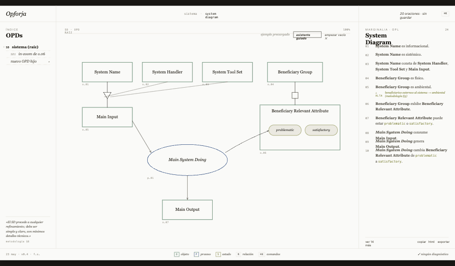
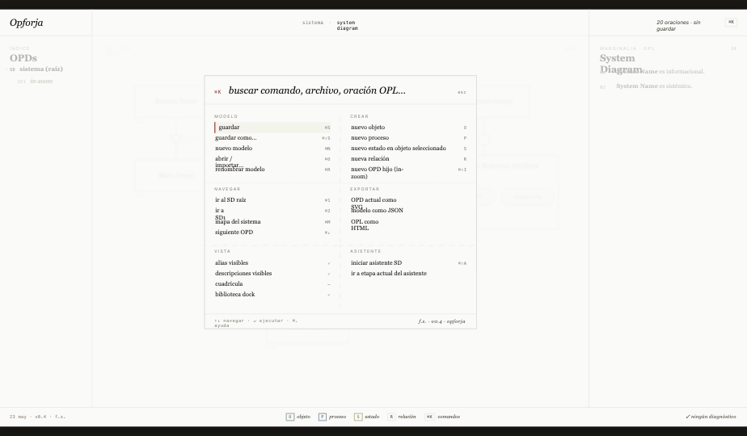
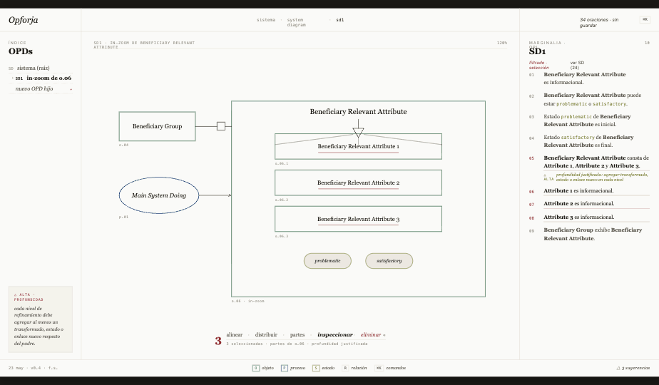
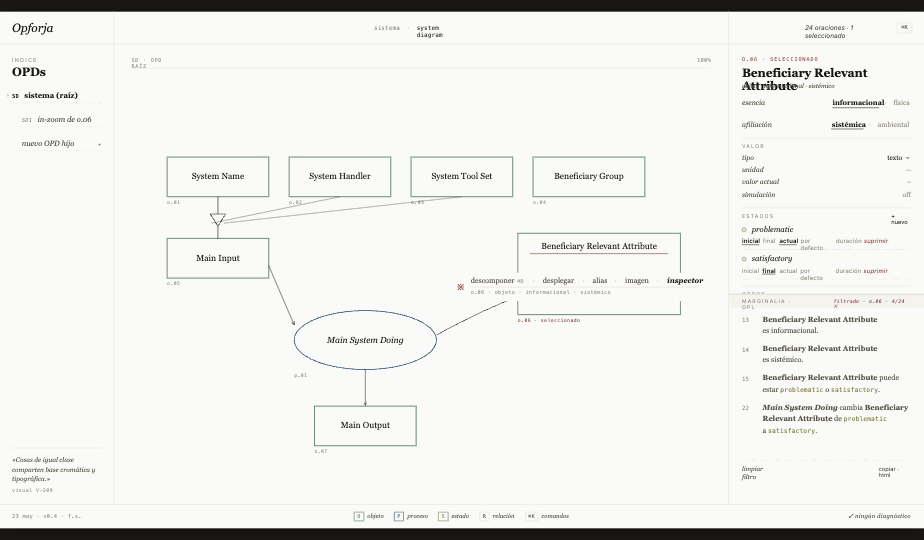

# OpForja · Codex — sistema de diseño

**Producto:** OpForja (editor OPM, render del canvas con JointJS)
**Propuesta:** Codex — editorial · marginalia · type-led
**Versión:** 1.2
**Fecha:** 2026-05-25
**Audiencia:** equipo de desarrollo que mantiene la implementación Preact

---

## 0. Scope crítico

Este handoff **NO incluye lógica de render del canvas**. OpForja usa **JointJS** para renderizar el OPD (símbolos OPM, enlaces, anchors, connectors, routing, selection, pan/zoom). Esa capa la maneja el equipo de desarrollo dentro de las opciones de JointJS — Codex solo especifica los **atributos visuales** (colores, strokes, fills, fuentes, markers) que se aplican a los shapes/links/highlighters de JointJS.

División de responsabilidades:

| Capa | Tecnología | Responsabilidad de Codex |
|---|---|---|
| **Chrome** (header, columnas, footer, command palette, inspector, OPL, barra emergente) | HTML/CSS | Diseño y componentes completos |
| **Canvas** (OPD con sus símbolos y enlaces) | **JointJS** | Solo apariencia — ver [`08-jointjs-styling.md`](08-jointjs-styling.md) |

---

## 1. Lectura rápida

Si tienes 5 minutos, lee:

0. [`GOVERNANCE.md`](GOVERNANCE.md) — **autoridad normativa y precedencia**
1. [`01-design-spec.md`](01-design-spec.md) §1 — **Filosofía**
2. [`03-scenes.md`](03-scenes.md) — **mira las 4 capturas y léelas en orden**
3. [`tokens.css`](tokens.css) — ábrelo y déjalo cerca

Si tienes una hora, lee todo en el orden numerado.

Para implementar:

1. **Chrome:** copia `tokens.css`, instala Inria Serif + Inria Sans + JetBrains Mono, implementa los componentes en `02-components.md` usando los HTMLs de `scenes/` como referencia pixel-fidelity.
2. **Canvas:** revisa `08-jointjs-styling.md` y aplica los attrs a tus shapes JointJS. Los HTMLs standalone NO incluyen JointJS conectado — el canvas se ve vacío en el standalone (es tu trabajo conectarlo).

---

## 2. Qué es Codex

Filosofía en una frase:

> **La página *es* la interfaz.**

OpForja se trata como un manuscrito anotado: el OPD vive como figura central, la OPL como marginalia tipográfica al margen izquierdo, y el árbol de OPDs junto al Inspector viven en el margen derecho como herramientas de edición. Sin barras laterales pesadas, sin tabs gruesos, sin botones cromados. Los comandos viven detrás de `⌘K`.

**Tres familias tipográficas, tres colores OPM canónicos, un acento crimson editorial.** Cero iconos vectoriales, cero shadows, dos pesos de hairline.

---

## 3. Estructura del sistema

```
ui-forja/
├── GOVERNANCE.md                ← autoridad normativa de diseño
├── README.md                    ← este archivo
├── 01-design-spec.md            ← lenguaje visual: tokens, type, layout, hairlines
├── 02-components.md             ← inventario de componentes HTML/CSS del chrome
├── 03-scenes.md                 ← 4 pantallas: qué hay en cada una
├── 04-opl-rendering.md          ← cómo renderizar OPL canónicamente
├── 05-interactions.md           ← interacciones del chrome (command palette, teclado)
├── 06-ssot-compliance.md        ← auditoría regla-a-regla contra OPM-ES v3.0.0
├── 07-glyphs.md                 ← catálogo Unicode (no hay iconos vectoriales)
├── 08-jointjs-styling.md        ← ★ apariencia del canvas (attrs JointJS)
├── tokens.css                   ← variables CSS importables (chrome y canvas)
├── tokens.json                  ← tokens en formato design-tokens.github.io
├── scenes/
│   ├── 01-editor.html           ← editor principal (chrome solo, sin JointJS)
│   ├── 02-command.html          ← command palette ⌘K
│   ├── 03-multi-select.html     ← selección múltiple en SD1
│   └── 04-inspector.html        ← inspector de objeto + OPL filtrada
├── screenshots/
│   ├── 01-editor.png            ← capturas de las scenes (chrome + mock canvas SVG)
│   ├── 02-command.png
│   ├── 03-multi-select.png
│   └── 04-inspector.png
└── src/
    └── variant-codex.jsx        ← implementación React de referencia del CHROME
                                   (incluye un canvas-mock en SVG inline para que las
                                    screenshots se vean completas — borrarlo al
                                    integrar con JointJS real)
```

---

## 4. Las 4 pantallas

### 01 · Editor principal


### 02 · Comandos (`⌘K`)


### 03 · Selección múltiple en SD1


### 04 · Inspector de objeto


Las cuatro son **el mismo editor** — comparten el frame, cambian lo que llena las 3 regiones y qué floating aparece sobre el canvas. Detalle por pantalla en [`03-scenes.md`](03-scenes.md).

---

## 5. Cómo inspeccionar en alta fidelidad

```bash
# Abrir cualquier escena standalone en un browser
open ui-forja/scenes/01-editor.html
```

Cada HTML standalone:

- carga Inria Serif, Inria Sans, JetBrains Mono de Google Fonts
- carga React + Babel (pinned)
- carga `../src/variant-codex.jsx`
- renderiza el chrome + un **mock SVG inline del canvas** (no JointJS)
- aplica auto-scale para que quepa en cualquier viewport

El mock SVG inline está **solo para que las screenshots se vean completas**. En producción, esa zona la renderiza JointJS. Cuando integres:

1. Elimina las funciones `CodexMainDiagram`, `CodexSubDiagram`, `CodexInspectorDiagram` y los helpers `CodexObject`/`CodexProcess`/`CodexState` (las funciones SVG inline) del `variant-codex.jsx`.
2. Reemplaza con un `<div ref={paperContainerRef}/>` y monta JointJS Paper allí.
3. Aplica los attrs definidos en [`08-jointjs-styling.md`](08-jointjs-styling.md) a tus shapes.

---

## 6. Cómo implementar

### 6.1 Stack sugerido

- Preact 10 — stack productivo del repositorio
- CSS variables del `tokens.css` al theme provider
- Una librería de fuzzy search para el command palette (ej. `fuse.js`, `cmdk`)
- **JointJS 3.7 core** para el canvas, sin Rappid
- Un linter de OPL para autocorregir verbos (ver [`04-opl-rendering.md`](04-opl-rendering.md))

### 6.2 Orden de implementación recomendado

1. **Tokens** — `tokens.css` al theme provider. Validar que las 3 familias cargan.
2. **`CodexFrame`** — shell de 3 columnas, estático.
3. **Tree + Column header + OPL note** — los componentes más numerosos del chrome.
4. **`CodexCanvasMount`** — el wrapper alrededor del `paper` de JointJS.
5. **JointJS shapes** — `codex.Object`, `codex.Process`, `codex.State` con attrs de `08-jointjs-styling.md`.
6. **Link styling** — markers por tipo (consume/genera/cambia/consta de/exhibe).
7. **Highlighters** — selección y hover (§5).
8. **`CodexSelectionAnnotation`** — barra emergente HTML, posicionada con `paper.localToPaperRect()`.
9. **`CodexInspectSection` + fields** — inspector completo.
10. **Command palette** — modal con secciones, búsqueda, keyboard nav.
11. **Sincronización canvas ↔ OPL bidireccional** — ver `05-interactions.md` §5.
12. **Atajos de creación, refinamiento, navegación**.

### 6.3 Tests visuales

Cada commit que toca el visual debe diff contra las screenshots de referencia. Las screenshots están a 909×540 — para diff exacto, escalar la captura del implementador a esas dimensiones.

### 6.4 Tests funcionales

- **OPD ↔ OPL bidireccionalidad:** seleccionar símbolo → OPL filtra; hover oración → símbolo se subraya.
- **Command palette:** todos los items invocables por teclado.
- **Edición de nombres:** regenera todas las oraciones OPL que lo mencionan.
- **Validación de OPL:** todas las oraciones usan verbos canónicos.

---

## 7. Lo que NO está en v1 (deuda explícita)

Documentado por capa en [`06-ssot-compliance.md`](06-ssot-compliance.md) §5. Resumen:

- **Proceso activo (in-flight)** — canal visual reservado pendiente (V-132 / §17)
- **Estado actual (current)** en el OPD — el flag existe en inspector pero el pin externo no se diseñó
- **Asistente SD interactivo** — el comando existe; el flujo wizard se diseña en v1.1
- **Sub-modelos / referencias inter-modelo** (§10 metodología)
- **Mapa del sistema** como vista navegable de miniaturas
- **Modo simulación** (§22)
- **Switcher de lengua OPL** (ES ↔ EN)
- **Dark mode**

---

## 8. Versionado

Codex v1.2. Cualquier cambio de:

- **token** → minor bump (v1.1)
- **frame layout** → major bump (v2.0)
- **componente nuevo** → minor bump
- **fix visual sin cambio de token** → patch (v1.0.1)

---

## 9. Contacto y proceso

Para decisiones que no resuelve este handoff:

1. Verificar primero contra la SSOT OPM-ES — la SSOT manda.
2. Revisar [`06-ssot-compliance.md`](06-ssot-compliance.md) por si la regla está mapeada.
3. Si es UX puro (no SSOT), abrir issue para discusión.
4. **NO inventar** colores, fuentes, espaciados ni componentes sin pasar por el design lead.

---

## 10. Filosofía resumida (para imprimir y pegar al monitor)

> 1. **Tipografía antes que UI.** Si una cosa puede ser texto, es texto.
> 2. **Hairlines, no shadows.** Cero elevación; excepción: sombra semántica de cosa física en canvas.
> 3. **El canon OPM manda en el OPD.** Chrome neutro. (Y JointJS dibuja, no tú.)
> 4. **Marginalia como herramienta semántica.** Las validaciones son notas al pie.

Buena implementación.
